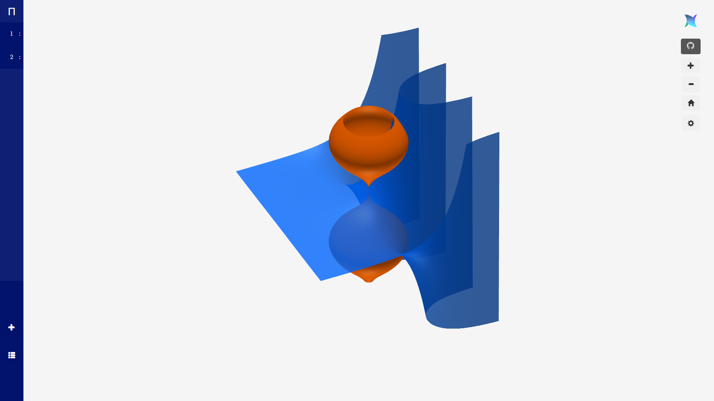
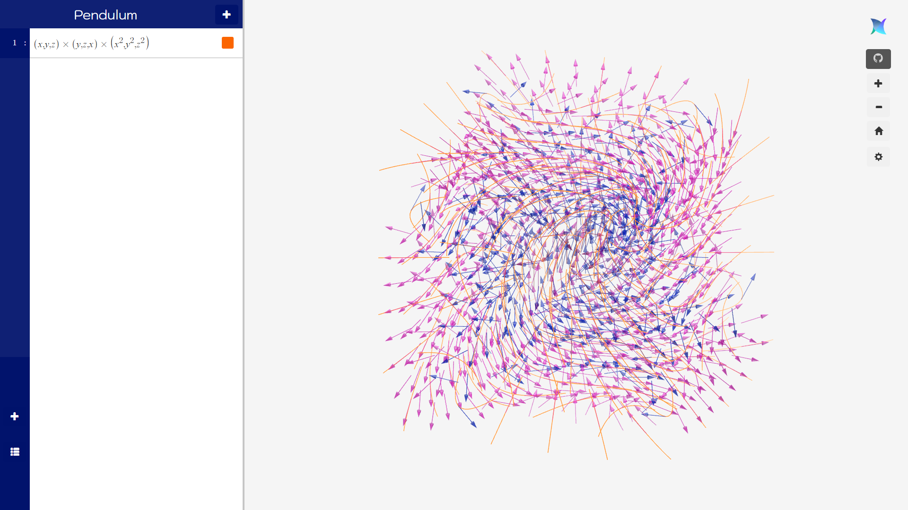
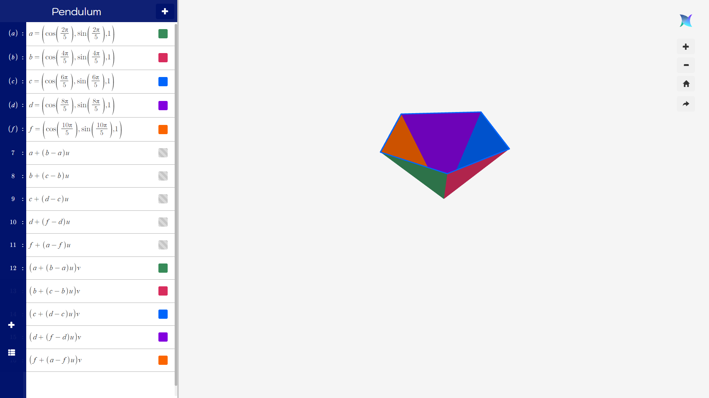

# Pendulum (Beta)

## Getting started
The current stable build of this software is available at https://cloudnest.org/pendulum/beta/. There is also a demo calculator
for calculating geodesics on revolutionary surfaces built on top of Pendulum available at https://cloudnest.org/pendulum/geodesics/.

For implementation details, please see [documentation](https://github.com/YuelongLi/Pendulum-beta/blob/main/doc/DOCUMENTATION.md).

You can try the following expressions in the calculator's expression field by copying and pasting them in one at a time:
* A cone:`\sqrt{x^2+y^2}`
* A wavy plane: `\sin(x)+\cos(y)`
* A morphism between a cone and a wavy plane: `\cos(t/4)^2\sqrt{x^2+y^2}+\sin(t/4)^2\sin(x)+\cos(y)`.

Clear all the equations with back spacing, and paste the following parametric functions:
* A trefoil knot `(\cos (4\pi u)(1+0.5\cos (6\pi u)),\sin (4\pi u)(1+0.5\cos (6\pi u)),0.5\sin (6\pi u))`
* A donut: `a=(\cos(2\pi u)(1+0.5\cos(2\pi v)), \sin(2\pi u)(1+0.5\cos(2\pi v)), 0.5\sin(2\pi v))`
* A sphere: `b=(\cos(2\pi u)\sin(\pi v), \sin(2\pi u)\sin(\pi v), \cos(\pi v))`
* A morphism between a donut and a sphere: `\cos(t/4)^2a+\sin(t/4)^2b`.

Clear again, and try the following complex expressions:
* Bell curve extended to the complex domain (real part): `a=e^{\frac{(x+iy)^2}{2}}`
* Bell curve extended to the complex domain (imaginary part): `b=-ie^{\frac{(x+iy)^2}{2}}`
* Morphism between real and imaginary part by rotating the complex phase: `e^{it}a`.

Clear again, and try vector fields:
* A simple vector field: `(x,y,z)`
* A vector field with curl: `(y,z,x)`
* Their cross product: `(x,y,z)\times(y,z,x)`.
* A complicated vector field: `\left(x,y,z\right)\times \left(y,z,x\right)\times \left(x^2,y^2,z^2\right)`



To test your knowledge, you can try making a trefoil knot that spins around the z-axis at a 1 revolution per
second rate.

## Basic Usage
### Key Concepts
* Inspired by [Desmos](https://desmos.com/), Pendulum uses a set of simple rules to infer the
  visualization type from plain LaTeX, as opposed to requiring users to state the visualization type,
  coordinate bindings explicitly.
* The **type** of the expression determines the visualization type, which
  then determines the **variable binding**. For instance, the expression `z=x+y` is an **equation**, this implies
  that the represented object will be a surface. The expression `(x,y,z)` is a **vector**, this implies the
  represented object is either a vector space, if supplied with 3 degrees of freedom `x, y, z`, or a parametric
  surface, if supplied with 2 degrees of freedom, `u, v`.
* **[Variable binding](###Variable Binding Rules)** is the building block for creating visualizations. Certain letters, `x`, `y`
  `z`, `u`, `v`, `t` would direct Pendulum to use them as coordinates in the 3D canvas, as parameterization,
  or as a timing variable.
* Pendulum **core** hosts a simple **virtual environment**, which evaluates JavaScript codes transpiled dynamically from
  LaTeX inputs into **variable models**. The **virtual environment** also supplies a **mathematics**
  module for performing operations on a generalized number type called **Quantity**, which can be real, complex,
  vector, or array.

### Variable Binding Rules
* `x` - x coordinate
    * In scalar expressions: cartesian independent variable, activates z-cartesian surface
    * In vector expressions: cartesian coordinate of the vector, activates vector field
* `y` - y coordinate
    * In scalar expressions: cartesian independent variable, activates a z-cartesian surface,
    * In vector expressions: cartesian y-coordinate of the vector, activates vector field
* `z` - z coordinate, cartesian dependent variable
    * In scalar expressions: cartesian dependent variable
    * In vector expressions: cartesian z-coordinate of the vector, activates vector field
* `u` - first parametric variable, activated in vector expressiones, populated by Pendulum in [0,1]
    * Vector expressions with only `u` and not `v` are treated as 1 dimensional parametric functions
    * `x, y, z` takes precedence in specifying fields
* `v` - second parametric variable, activated in vector expressions, populated by Pendulum in [0,1]
  * Vector expressions with `v` are treated as 2 dimensional parametric functions
* `x, y, z` takes precedence in specifying fields, `u` and `v` then treated as algebraic variables
* `i` - the imaginary unit, activated in all expressions, visualizations casts $f\in\mathbb{C}$ to $\mathbb{R}$ by taking its real part
* `e` - the Euler's constant
* Any other alphabet letters are treated as algebraic variables, and can be specified in separate expressions, or left unspecified in the left hand side for explicit definition (or left unspecified in anywhere in the expression for implicit definition, in the future).

### Supported Operations (all extend to complex fields)
* $+$, $-$, $\times$, $\frac{a}{b}$, $a^b$ (scalar)
* $+$, $-$, $\times$, $\cdot$ (vectors) (cross product, dot product if operands are both vectors)
* $\sum...$, $\prod ...$ (any with explicit lower and upper bounds)
* $\cos$, $\sin$, $\tan$, $\cot$ (real scalar)
* $\log$ (scalar)
* $\nabla$, $\nabla \times$ (vector fields)
## Building
## API Usage
Pendulum API can be used for automating or customizing visualizations.
```typescript
let p = new Pendulum(canvas);
```
### Field Injection
#### Single Equation:
```typescript
/**
 * Injects a field into the UI, returns the label of that corresponding field
 * @param tex the content of the field injections
 * @return definitionControl the control handle the injected field
 */
injectField(tex: string):DC
```
Usage:
```typescript
p.injectField("\\sin (x)+y");
```

#### Import Equation sheet:
```typescript
/**
 * Load an entire session of statements
 * @param texSheet json string representing the equation sets
 */
loadTexSheet(texSheet: string)
```
JSON Format:
```typescript
//Inside loadTexSheet:
let eqns:EqnExport[] = JSON.parse(texSheet);
//Where
class EqnExport{
    tex: string;
    color: string;
    visible: boolean;
}
```
Usage:
```typescript
p.loadTexSheet(`[{"tex":"a=\\\\left(\\\\cos\\\\left(\\\\frac{2\\\\pi}{5}\\\\right),\\\\sin\\\\left(\\\\frac{2\\\\pi}{5}\\\\right),1\\\\right)","color":"blue","visible":false},{"tex":"b=\\\\left(\\\\cos\\\\left(\\\\frac{4\\\\pi}{5}\\\\right),\\\\sin\\\\left(\\\\frac{4\\\\pi}{5}\\\\right),1\\\\right)","color":"blue","visible":false},{"tex":"c=\\\\left(\\\\cos\\\\left(\\\\frac{6\\\\pi}{5}\\\\right),\\\\sin\\\\left(\\\\frac{6\\\\pi}{5}\\\\right),1\\\\right)","color":"blue","visible":false},{"tex":"d=\\\\left(\\\\cos\\\\left(\\\\frac{8\\\\pi}{5}\\\\right),\\\\sin\\\\left(\\\\frac{8\\\\pi}{5}\\\\right),1\\\\right)","color":"blue","visible":false},{"tex":"f=\\\\left(\\\\cos\\\\left(\\\\frac{10\\\\pi}{5}\\\\right),\\\\sin\\\\left(\\\\frac{10\\\\pi}{5}\\\\right),1\\\\right)","color":"blue","visible":false},{"tex":"a+\\\\left(b-a\\\\right)u","color":"blue","visible":true},{"tex":"b+\\\\left(c-b\\\\right)u","color":"blue","visible":true},{"tex":"c+\\\\left(d-c\\\\right)u","color":"blue","visible":true},{"tex":"d+\\\\left(f-d\\\\right)u","color":"blue","visible":true},{"tex":"f+\\\\left(a-f\\\\right)u","color":"blue","visible":true},{"tex":"\\\\left(a+\\\\left(b-a\\\\right)u\\\\right)v","color":"purple","visible":true},{"tex":"\\\\left(b+\\\\left(c-b\\\\right)u\\\\right)v","color":"orange","visible":true},{"tex":"\\\\left(c+\\\\left(d-c\\\\right)u\\\\right)v","color":"green","visible":true},{"tex":"\\\\left(d+\\\\left(f-d\\\\right)u\\\\right)v","color":"red","visible":true},{"tex":"\\\\left(f+\\\\left(a-f\\\\right)u\\\\right)v","color":"blue","visible":true}]`);
```
Result:



#### Export Equation Sheet:
```typescript
/**
 * @return texSheet the TeX sheet representing the currently populated 
 * statements, along with the graph color and visibility attributes
 */
exportFields():string
```
Example Usage:
```typescript
window.share = ()=>{
    let texSheet = p.exportFields();
    download("savedtex.txt", texSheet);
}
```
Result: *downloads a txt file containing the equation sheet string:
```json
[{"tex":"a=\\\\left(\\\\cos\\\\left(\\\\frac{2\\\\pi}{5}\\\\right),\\\\sin\\\\left(\\\\frac{2\\\\pi}{5}\\\\right),1\\\\right)","color":"blue","visible":false},{"tex":"b=\\\\left(\\\\cos\\\\left(\\\\frac{4\\\\pi}{5}\\\\right),\\\\sin\\\\left(\\\\frac{4\\\\pi}{5}\\\\right),1\\\\right)","color":"blue","visible":false},{"tex":"c=\\\\left(\\\\cos\\\\left(\\\\frac{6\\\\pi}{5}\\\\right),\\\\sin\\\\left(\\\\frac{6\\\\pi}{5}\\\\right),1\\\\right)","color":"blue","visible":false},{"tex":"d=\\\\left(\\\\cos\\\\left(\\\\frac{8\\\\pi}{5}\\\\right),\\\\sin\\\\left(\\\\frac{8\\\\pi}{5}\\\\right),1\\\\right)","color":"blue","visible":false},{"tex":"f=\\\\left(\\\\cos\\\\left(\\\\frac{10\\\\pi}{5}\\\\right),\\\\sin\\\\left(\\\\frac{10\\\\pi}{5}\\\\right),1\\\\right)","color":"blue","visible":false},{"tex":"a+\\\\left(b-a\\\\right)u","color":"blue","visible":true},{"tex":"b+\\\\left(c-b\\\\right)u","color":"blue","visible":true},{"tex":"c+\\\\left(d-c\\\\right)u","color":"blue","visible":true},{"tex":"d+\\\\left(f-d\\\\right)u","color":"blue","visible":true},{"tex":"f+\\\\left(a-f\\\\right)u","color":"blue","visible":true},{"tex":"\\\\left(a+\\\\left(b-a\\\\right)u\\\\right)v","color":"purple","visible":true},{"tex":"\\\\left(b+\\\\left(c-b\\\\right)u\\\\right)v","color":"orange","visible":true},{"tex":"\\\\left(c+\\\\left(d-c\\\\right)u\\\\right)v","color":"green","visible":true},{"tex":"\\\\left(d+\\\\left(f-d\\\\right)u\\\\right)v","color":"red","visible":true},{"tex":"\\\\left(f+\\\\left(a-f\\\\right)u\\\\right)v","color":"blue","visible":true}]
```

## //TODOs

1. Pull from embeddable.
2. Make main branch UI modular.
3. Write instructions for Geodesics calculator usage
4. Create tests.
5. Migrate UI & state management to react.
6. Add parametric type forcing.
7. Tune array cartesian product behavior.
8. Field line tracing with GLSL?

Distant future: integration of core with CUDA?