# Documentation
A brief log of the important design decisions and implementations made along the way.
## Project setup

### Node
``npm init``r
Prompts the project setup procedures, and creates package.json.

Reference: https://docs.npmjs.com/cli/v7/commands/npm-init

### Typescript
Standard language of the project for modular development

Reference: https://robertcooper.me/post/get-started-with-typescript-in-2019

`npm install --save-dev typescript` local installation

### Compilation
To ensure simplicity of the development environment, I will experiment with using only the typescript transpiler in the development phase
and do away with Grunt. Create a tsconfig.json file with `tsc --init`. 

`tsc` for one-time transpiling

`tsc -p` for automated transpiling


### Source Mapping
Typescript provides the functionality for source mapping as an option in ts-config.json. A thorough introduction to the options for 
typescript source mapping provided here: https://www.carlrippon.com/emitting-typescript-source-maps/. Why do we want to use source maps?
That's because after transpilation and building, the code will become scrambled and unclear. In order to debug from this clutter,
a mapping from the generated files back to the original files must be created. With the help of source mapping, browsers like Chrome will
display the original code in the developer console and developers can directly set breakpoints or see error references to the original code.
More details on: https://trackjs.com/blog/debugging-with-sourcemaps/.

### Module
- In order to resolve a reference issue in the transpiled code of helloworld.ts, the commonjs npm module is added.

- The solution doesn't really work, the commonjs module is kept since why not.

- As noted through many trials, typescript faces immense trouble when directly producing browser compatible code. In particular, the output
of typescript transpilation is optimized for commonjs, a format that presumes the nodejs environment with keywords such as require built in.
The transpilation does not compile into the resultant files any source codes from relevant modules such as three.js, but simply presumes
the usefulness of 'require' magic. In order to resolve this problem with module loading, and potentially many future issues, the transpiled code 
provided by typescript need further transformations such as browserify to become browser compatible. After some digging, a good pipeline that 
streamlines this whole process of multiple transformations is to be found at: https://gist.github.com/michalochman/d64360541a484e16817c. 
The pipeline is based on gulpfile, which in my opinion is better than nothing.

#### Gulp
Again, in order to resolve the module building issue with typescript, this time gulpfile is used for the building task. Installation for Gulp is to be found
at https://gulpjs.com/docs/en/getting-started/quick-start. One also need to install all the modules required by https://gist.github.com/michalochman/d64360541a484e16817c
for the gulpbuild.js in the directory to run correctly.
- Multiple error persisted with the use of Gulp, it turned out that 'three/src/three.js' is using import and export statements that aren't in the 
  common js standard, but 'three/build/three.js' is. Gulp was not the key to the solution. After changing the import directory in helloworld.ts from
  'three/src/three.js' to just 'three', the issue was resolved without the help of Gulp.
  
#### Final working solution
- Import 'three' in the ts scripts, use `tsc` for transpilation from ts to commonjs, use
`browserify DIR/SOURCE -o DIR/OUT` to transform the commonjs code to browser compatible ones.
  
- Next I would like to try automate this process with something like grunt, and find out how to build source maps

### Gulp again
- Now that a working solution has been established, I would like to add in the function of automation, which after some research, advocates for the use 
  of Gulp over Grunt: https://www.keycdn.com/blog/gulp-vs-grunt. So Gulp again, but this time not to resolve an ongoing issue, but to help
  improve the development flow with its power in automating processes. This article comes handy in getting us started with Gulp https://www.typescriptlang.org/docs/handbook/gulp.html.
- To understand how files get passed around and processed in gulpbuild.js, one shall read https://gulpjs.com/docs/en/getting-started/working-with-files/.
  Gulp makes extensive use of Node streams. To understand how Node streams work on an interface level, which can be helpful in future developments in user
  collaboration functionalities, check https://nodesource.com/blog/understanding-streams-in-nodejs/ (super clear & interesting by the way).
- A gulpbuild.js needs to be added, which should contain all the streamlined methods provided by gulp modules for the file processing facilitated by Node streams. The current
  stream is tsc and then browserify the generated .js files.
  
### Browserify
The browserify module on itself can also perform typescript transpilation with the help of a plugin called tsify (https://www.npmjs.com/package/tsify). 
This is the method for integration with Gulp that was
officially adopted by typescript. tsify reads from the tsconfig.json with a few exceptions, the behaviors of which are described in the link above. One 
important exception is that when the debug option for browserify() is set to true the source map for the entire process, including 
transpiling into javascript and bundling the modules, gets generated regardless of what has been specified in the tsconfig.json. The generated 
file content can then converted into vinyl format using source, a gulp module placed in the pipeline.
  
### Source mapping with Gulp and Browserify
Gulp provides build in functionality for source mapping with the module gulp-sourcemaps. Aside from supporting source map generations for official plugins,
it also supports loading existing source maps from vinyl up streams. The specifications are here: https://www.npmjs.com/package/gulp-sourcemaps. On the page
https://www.typescriptlang.org/docs/handbook/gulp.html, the complete use case of typescript->javascript->browserify using gulp with sourcemap is also provided.

### Watching
Monitoring the changes made to the typescript programs in src directory and updating the corresponding transpiled programs in the dist directory can be extremely
helpful in the process of debugging. Since only the transpiled javascript program organized in the dist folder can be run and tested in a browser, building them in real
time streamlines the workflow. One gets to test changes made to the program without having to actively recompile by simply refreshing the browser, while the building
process becomes largely invisible to programmers.

## Licensing

A helpful reference resides here: https://www.synopsys.com/blogs/software-security/5-types-of-software-licenses-you-need-to-understand/. 
The goal of our ultimate licensing is to permit the use of external libraries such as three while maintaining proprietorship to our own designs.

## Graphics
- A module plugged into core
- Takes care of the rendering of functionals/functions given by core. Keeps track of the graphical objects called Graph
- Generates materials / visualization styles specified by users.
- Updates the function when it is changed, with the help of a listener
- Gives feedbacks to core based on the rendering process

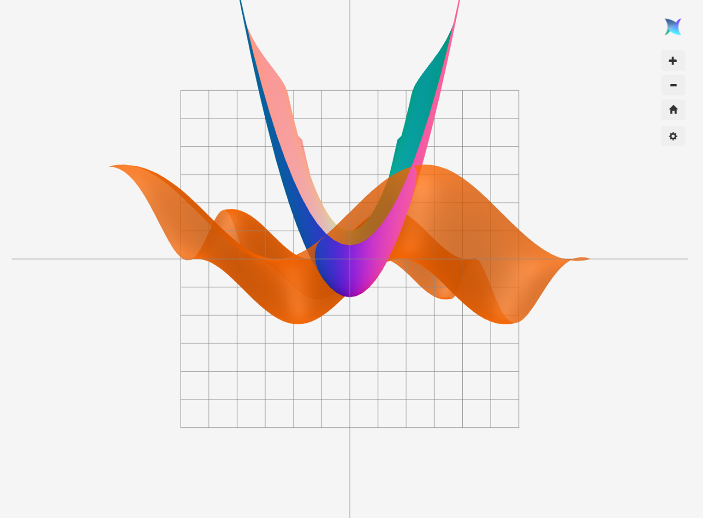

### Three
The core API to be used for various visualizations is threejs, a library which makes stunning visualizations using WebGL. For 2D visualizations using
three, an example can be found here: https://observablehq.com/@grantcuster/using-three-js-for-2d-data-visualization. 

### Canvas


Canvas wraps around all canvas related objects, including THREE.scene, THREE.camera, the htmlDiv, and so on. It also holds the animation method for continuous rendering.
With the combination of Canvas and Graph, one can quickly add a graph to the canvas by calling Canvas.addGraph(graph). This gives one the ability to manipulate the canvas
imperatively, by calling methods that wrap around multiple function calls that achieve certain actions on the canvas. The Three objects inside Canvas are still publicly
exposed, so one still have the option to operate on them directly. Canvas also listens for window resize events, so that it can adjust the renderer size accordingly.

### Graph
The basic wrapper around each graphable object. It contains necessary information about the object that is being rendered, such as its material,
its vertices and geometry, and it also holds plotting algorithms that transform equations into its corresponding visual representations.
As an abstract class, we have its structure defined:
```typescript
/**
 * The abstract interface for a visualized graph
 */
abstract class Graph {
    name: string;
    material:THREE.Material;
    mesh: THREE.Mesh;
    //Vector providing camera position for rendering optimization
    cameraPosition: THREE.Vector3;
    protected constructor (name: string) {
        this.name = name;
    }
    /**
     * Returns the effective bounds of visualization for this graph
     */
    getBounds(): number[][] {
        return [[-5, 5], [-5, 5], [-5, 5]];
    }

    /**
     * Constructs geometries without populating them
     * @param param parameters specifying the geometry
     */
    abstract constructGeometry(param:{[key:string]:string}):void;

    /**
     * Populates the geometry of this graph
     */
    abstract populate(): void;

    setMaterial(material:THREE.Material){
        this.material = material;
    }

    /**
     * Called by canvas to update rendering orientations
     */
    abstract updateOrientation():void;

    abstract update():void;

    /**
     * Disposes the THREE mesh and geometries of this, releasing their memory
     */
    abstract dispose():void;
}
```
Among the methods, .constructGeometry is to be called to instantiate all Three visualization objects, and .populate is to be called for the mapping of the 
function/field/other mathematical object that the graph is intended to represent onto the visualization objects.

### Cartesian graph
Subclass extending Graph. This is a class specializing in the visualization and subsequent updating of cartesian functions f:(x, y) => z. The primary THREE object that it keeps is a 
`THREE.BufferedGeometry` object. With `THREE.BufferedGeometry`, one is able to, by specifying its buffered attributes, positions of the vertices, the 
composition order of vertices to make the facelets, and so on. 

The .populate method of this class utilizes a mapping (x, y) = M(u, v), M: (0, 1)^2 => R^2, to determine the x, y locations of the vertices to be generated. Then 
the generated x, y coordinates are placed into the function f, yielding z = f(x,y) = f(M(u,v)) for the z coordinates of the vertices. M should be a conformal mapping,
and its main purpose is to dynamic adjustment the positions of the vertices for rendering optimization, while maintaining an unvaried general appearance of the generated mesh that depends
primarily on f.
#### Transparency problem
- The facelets are rendered in the order they appear inside the vertices array.
- The earlier they appear, the earlier they get rendered into pixels.
- For facelets that are semi-transparent, they have less than 1 alpha values. For facelets with α<1, their rasterized pixels should blend with the colors of the facelets behind them, and if 
there were multiple facelets cascaded together, then each should pass on the colors of previous layer according to a formula like:
  C1 = αA + (1-α)C0, where C0 is the previous color, C1 the new color, and A is the color of this facelet.
  
    This makes the distance of the facelets rendered to the camera very important. If two
  facelets occupy the same pixel, the facelets that is further away from the camera should get rendered first, and the one closer should get 
  rendered on top of the previous pixel to have the rendered color properly blended. This distance is called the z-buffer.
  
- However, for optimization reasons, the renderer of webGL will not explicitly sort the z-buffer of each pixel before rendering them, so that there 
  is no guarantee of the order of rendering except for the order in which they come in the vertices array one specifies. If the facelets with a 
  smaller z-buffer happened to get rendered before the ones with a higher z-buffer, then its pixel color is computed without knowing the need what's behind. 
  Even when the facelets behind get rendered later, because the current pixel is showing the color of a facelet with a lower z-buffer, the renderer will have no choice but ignoring them.
  
- This creates the transparency issue, making certain facelets that were supposed to show through the transparent facelets in front of them not rendered, such that 
  when looking from the users' perspective, it appears as if the transparent faces have become opaque.
  
    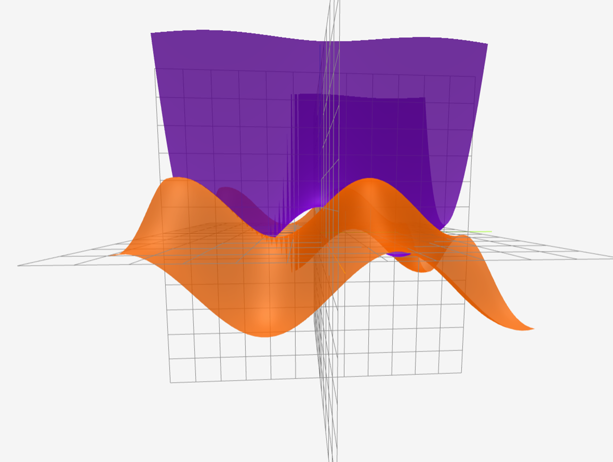  
    As can be seen from the screenshot above, parts of the surfaces in front no longer appear transparent.


- For CartesianGraph, the rendering order (the order in which the vertices appear in the vertices list), is determined by the vertex enumeration 
  following:  
  
  where ui and vj are equally spaced between [0, 1] following ui = i/|U|, vj = j/|V|, and M by default is
  ,   
  in which _l_ is the side length of the region of visualization.
  

-  Note that all vertices along the v direction gets generated first,
   before moving on to a new u index. When Camera is looking at the mesh from the  position, this generation order makes sure that all elements behind
   are rendered before the elements in front, so there are no transparency issues. 
    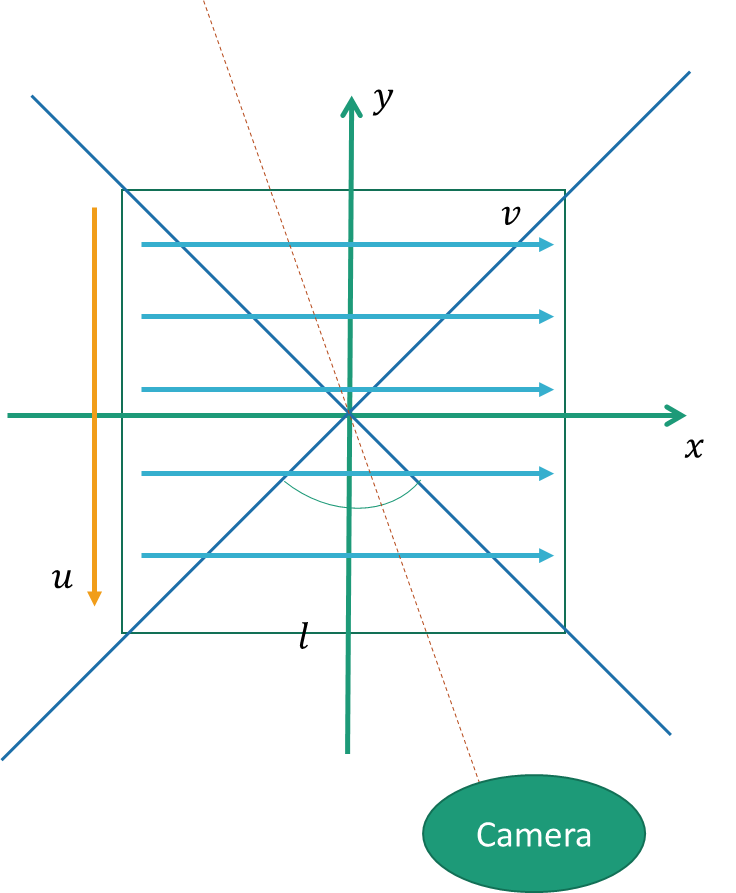
   
- However, if we look from the position of , the rendering order is not gauranteed with the previous mapping. In this case,
we simply need to rotate the mapping 90 degrees. 
  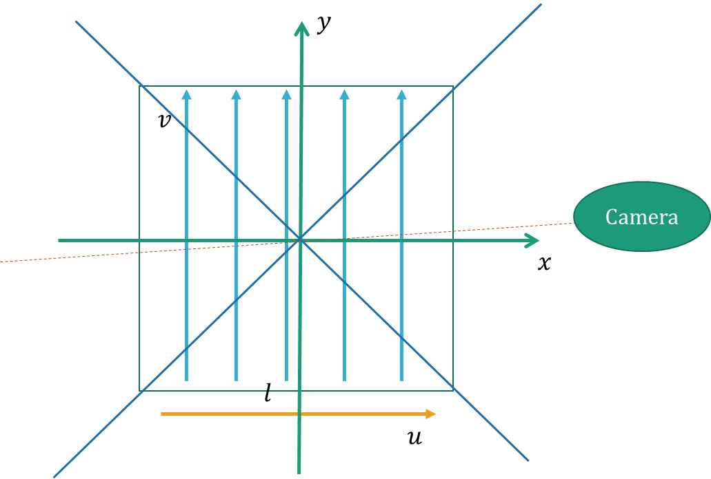
- In general, divide the space into four orientations:
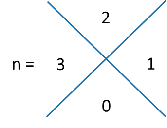,  
  and apply rotation matrix to the original map:
  .
  
If we update this mapping M:(u,v)->(x,y) each time the camera enters into a new orientation and repopulate
the vertices, there will be no self-transparency issues with cartesian graphs, creating the illusion that the renderer
is explicitly sorting the facelets behind the hood, while enjoying maximal rendering responsiveness.

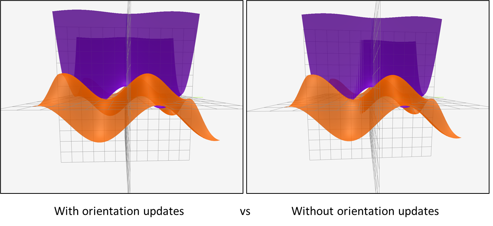

### Vector3D
This is a subclass of graph that deals with the visualization of vectors. This class serves to visualize 
a single vector at a specified origin using `THREE.BufferedGeometry`. One needs to specify the `number[]`
typed vector upon its initialization. When populate is called, it internally constructs a 3D basis with 
the current direction specified by the vector, and builds an 3D arrow mesh around this basis. Optional
parameters of the class include `colorInterface, lengthInterface` that computes the length and color of
the visualizations based on the specified vector. There is also `tailRadius` and `headRadius` specifying
the size of the tails and heads of the visualization. `cCount` and `zCount` are constants specifying the 
mesh fineness, and are pre-adjusted to an optimum configuration.
#### Basis creation
The goal is to construct a basis with the z' axis aligned with the vector. The x' and y' component lying
perpendicular to the z-component. We use polar coordinate system to achieve this goal. Suppose the 
visualized vector is $\vec{r}$, then the z' vector will be $\hat r$, x' and y' will be $\hat{\theta}$
and $\hat{\phi}$ respectively in this case.
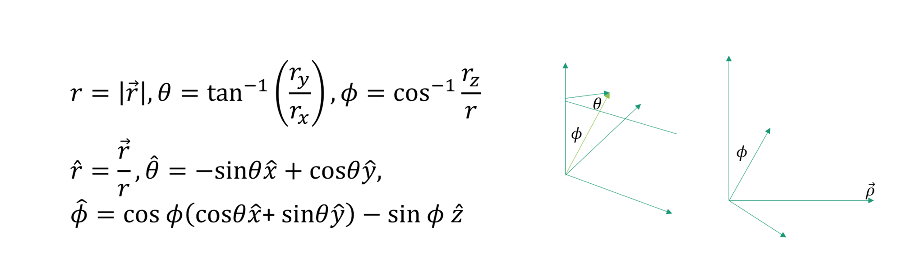
For the special case where rx = 0, we pick θ = π/2, which takes care of the case where \vec r is aligned
the z axis or being in the yz plane. 
#### Mesh creation
The parameterized surfaces of the arrow are as follows.
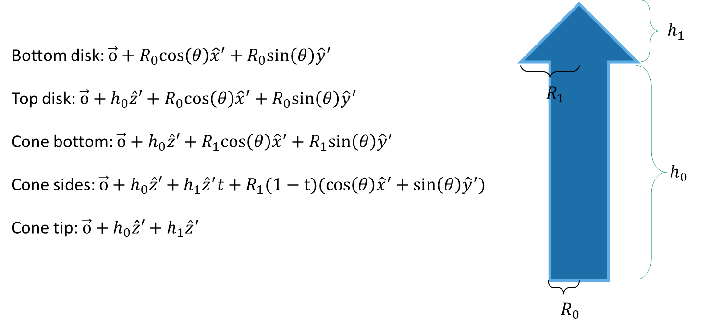
To optimize for efficiency, we try to make a high quality 3D arrow mesh with the least number of 
vertices. The cylindrical part is produced by its bottom disk and its top disk, each mapped using
cCount vertices, the top and bottom surfaces are then connected using triangles.
For the cone, it is generated with two disks in the z direction, and a single vertex at exactly the tip.

## Core (`Core`)
Core is the computation center that gives life to the Pendulum system. It
- Receives and compiles commands from the UI
- Demands updates on various modules
- Routes the behavior of the interactive components
- Hosts and manipulates the virtual environment (`Core.Environment`) of variables, functions, and commands.

Asynchronous updates with listening form the basis of interactions between modules.
### Environment (`Core.Environment`)
- A "virtual machine" that maintains all the variables and their relations,
- Also takes care of processes, a Pendulum analog of threads in regular programming languages.
  
### Information flow
- Core monitors the environment module, and issues commands that display the inner states of the environment module.
  
- Each statement tree is passed from UI module into the core, which keeps a mapping of the statement back to the UI component. The Core
  then parses the statement tree into an instruction type, a script, along with a list of scripts for the leaf nodes of the tree, and passes 
  them as parameters into Core.Environment.
  
- The Core.Environment generates a variable/process based on the statement, and returns it.

- The core then responds to the newly created (Core.Environment.)Variable with follow-up actions, in particular making attempts to its algebraic local variables,
  calling Graphics.makeGraph(function, style) to generate a graph, and assigning it back to the Variable.
#### TeX statement
TeX statements are directly taken from user inputs. They are intuitive mathematical expressions that specify the structural relationships between variables. 
Mathquill offers the great functionality that enables responsive rendering of laTeX, making it possible to hide the complicated TeX statements in the back 
scene for users unfamiliar with it. Advanced users will be able to type directly in laTeX to make things efficient. Further, the texts backing the rendered 
mathematical statements can be easily retrieved by Core and parsed into statement trees. Each TeX statement in the user inputs is parsed into a separated 
statement tree.

TeX:`f(x) = \int_a^b t\sin(t-x) dt`  
Rendered:  
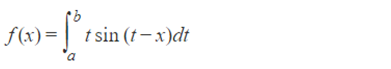

#### Statement trees
A tree structure representation of the original statement, where each operator is assigned with two or three
children, each capable of providing a number out of recursion.
```javascript
// structure = [operator, structure1,... structure#]
let statementTree = [operator,[operator, argument1, argument2], [operator, argument1, argument2, argument3]];
```
- Since programmed recursion on tree structures is not fast enough, they will be compiled into js scripts.
- The leaf nodes of the statement trees are important because they have to supply specific numbers for the recursion of the
  trees to work. In the cases where they don't supply numbers directly, they must be single variables that either have a public or 
  local scope.
#### Pi Script
The statement tree is compiled by the Core, or the Environment into scripts, which is a javascript concatenated recursively together to be executed
inside contexts.
- Due to performance reasons, it's very cumbersome to write the ultimate code for computation
that gets executed millions of times per-second in switch statements and hashmap virtual memories. The
best solution is to avoid creating a higher level language, and simply supply a context for regular
javascript to operate. Javascript will get generated recursively based on the original statement trees to reflect 
the mathematical expressions they represent.
It will also be possible to write pi script directly into the user interface. The core will then weakly compile the pi script
to check for security threats and supply it with necessary details such as contexts, scopes, and variable references. Once resolving
the variable references, dependency trees will be built and traversed.

### Variable (`Core.Environment.Variable`)
This is a class that passively contains its reference to interactive-interfaces such as fields and graphs. It also contains references to its dependencies and 
dependents, these provide crucial information for the Core.Environment module to run the procedures that maintain the variables.
- The environment module helps recognize dependencies, and initiates dependency pulses each time a variable is defined/redefined.
- A variable may further contain algebraic local variables, the values of these local fields and must be synchronously locked when accessed by
  different threads, or their accessors must provide a context which uniquely stores their values.
  ```javascript
  //local algebraic var = [graphics1, graphics2]
  x=[12.5, 67.2]
  // x is a algebraic local variable, it doesn't and shouldn't have a clearly defined value. Instead, its value varies based on contexts.
  ```
### Local variable
The entire idea of the name "local" is that they are variables located inside variable definitions. They are the variables of variables. It is easy
to locate local variables inside statement trees --- they are the non-constant leaf nodes of a statement tree. There are currently two types of local variables,
the local function variables, and the local algebraic variables.

#### Local Algebraic Variable
Local algebraic variables are non-constant leaf nodes of a statement tree that don't reference to any public variable definitions
- Their values are not clearly defined
  by the statement trees, and thus the name algebraic --- what matters is its algebraic relations to the rest of the expression.
- The specific contexts such as vertex generation (graphing) or integration will supply them with numerical values.

#### Local function variable
Local function variables are local variables that reference to other publicly defined variables. This idea might sound a little confusing since these "local" variables are actually
representing public variables. However, the publicly defined variables actually do not always have their values immediately available. For example a public variable `a=x+6` is dependent
upon `x`, a value that needs to be supplied at run time. That is why these public variables are more like <b>functions</b> when they get referenced, i.e., their evaluation requires the supplication
of more independent variables. There are two ways that independent variables of functions are supplied --- either through contexts and parameter lists.

  - Non-parameterized function variable:  
  If a (local) function variable doesn't have its independent variables explicitly stated, like `b=\sin(15x)-c`, referred by a variable definition `d = b-x`, 
  its evaluation only relies on `context` to give the value of `x` and perhaps `c`. In this case it's non-parameterized. 
  
  - Parameterized function variable:  
  If a function variable have explicit statements about its independent variables, such as `f(x) = x^2+b`, it relies on both `context` 
  and `parameterList` to supply its evaluations. The `parameterList` contains the explicitly stated local variables, in this case `x`, and 
  the `context` contains values for other algebraic variables. In this case it is parameterized.

### Reference list (for local variables)
To avoid repeated reading from hashmaps, a reference list accessed by indices will be created _inside Variable_ when compiling statement trees into pi scripts. The scripts 
generated for leaf nodes in the statement tree will contain references to indices instead of the original variable names. Mapping between
the specific var names and the indices will be kept in `Variable` instances. The reference list has a nested array structure. Each top-level item
contained in the reference list is called a "reference". Each reference is a list (tuple).
```javascript
variable.referenceList = [reference1, reference2, //...
                         ];
```


The first entry of a reference always specifies the type of the local variable. Currently, there are three types (subject to expansion):
1. Constant --- a number acquired from a deterministic variable reference.  
    * Example input:  
    
    * Inside variable:
   ```javascript
   variable.referenceList = [[1, 625]];
    ```
2. Function --- the value of the local var is non-deterministic after initialization, either because the reference requires input parameters that are non-deterministic,
   or because the referenced variable implicitly depends on non-deterministic variables like algebraic vars or other non-deterministic functions. The evaluate function of
   the corresponding `Variable` is stored in the second entry of the tuple.  
   * Example input:  
     
   * Inside variable:
   ```javascript
   variable.referenceList = [[2, π.getChild('f').evaluate]];
   ```
   
3. Algebraic --- Algebraic local variables are the local variables that don't have any statements to define them. Their values need to be supplied by a `context` in
   the run-time. The exact location of a algebraic variable inside the context matrix is specified by the second and third entries of its reference.
   * Input:  
   ,  
   where c0 a constant term supplied by the program to populate a solution set, and x the graph variable that is to be supplied by the Graphics module. 
   
    * Inside variable:
   ```javascript
   //For algebraic typed references, the second entry specifies the letter,
   //the third entry specifies the subindex, with -1 corresponding to no index,
   variable.referenceList = [[3, 24, -1], 
                             [3,  3,  0]];
   variable.context = [[],//a
                       [],//b
                       [NaN,11.34], //c0, some number supplied by the caller
                       //...
                       [0.79], //x, some number supplied by the caller (graphics module)
                       [],//y
                       [],//z
                       [],//\vec{a}
                       [],//\vec{b}
                       [],//\vec{c}
                       //...           
                       [],//\vec{z}
                      ];
   ```
    * Valid algebraics: $a_1$, $a_3$, $\{z_i\}_{[10]}$,  
    Non-valid algebraics: μ, $P _{ressure}$, $\text{System}$.
   
### Context
A `context` is a 2D array structure supplied by the different callers that wish to evaluate the variable.
Again, one avoids the map structure because it is really slow in javascript. For efficiency reason, the first dimension of the array needs to be small, and its second
entry will be dynamically allocated during run time. This naturally gives rise to the syntax that algebraic local variables can only be <b>single alphabetical letters</b>, with or
without positive sub-indices. Its sub-indices, which have to be non-negative, will specify its location along the second axis of the context mapping.

Each variable has a `evaluate(inputs,context)` function that wraps around the pi script. When calling the variable, a context with certain variables specified will be passed in, and the 
same context will be passed down recursively to all subsequent $.evaluation$ calls dispatched by the current instance:

```javascript
 variable.context = [[],//a
    [],//b
    [NaN,11.34], //c0, some number supplied by the caller
    //...
    [0.79], //x, some number supplied by the caller (graphics module)
    [],//y
    [],//z
    [],//\vec{a}
    [],//\vec{b}
    [],//\vec{c}
    //...           
    [],//\vec{z}
];
```

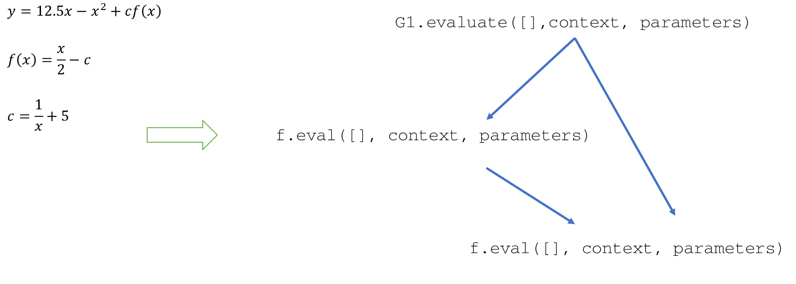  

#### Function context
Sometimes a function takes a long time to compute, and its returned value for the same set of algebraic values may get reused. 
When this is the case, the core will attempt to employ dynamic programming to speed up computations. Using a function context
dynamic programming for non-parameterized functions can be achieved.
- funcContext has a slightly different structure:
    array: `[[],...,[[27, *, 2]],...]`
  The first entry of the third axis is the value that the variable has. THe second is its assigned clock cycle number.
  There is also an additional parameter passed as the public clock cycle supplied by the root caller of the evaluate function.
  Each time when an update occurs the clock number gets increased by 1. When the clock number of a function does not match the 
  supplied value, it means the function needs to be re-evaluated. Its pi-script will be conditionally executed, and its value
  will be in the first entry of the third axis of the function context, and its clock # will be updated. If the clock # of
  a function matches the cycle, its value will be directly retrieved from the first entry.
  
- Local variables of multiple statements may share the same definition. However, their values can be completely different
  in the same of context if the evaluation of the function relies on independent variables. That's why only non-parameterized
  functions are available for dynamic programming.
  
- Function namings that don't follow the algebraic variable naming will not be available for dynamic programming.

### Vector Processing
Besides scalars, Pendulum also needs to support algebraic operations of vector and array typed quantities, 
as well as complex numbers. We start by specifying the set of conventions
governing i/o and operations of vector & array typed quantities.

#### Parsing Conventions
For the parsing conventions we want something that are powerful and robust, allowing operations like creation of matrices,
cartesian products. Here, we make the behaviors of arrays and vectors distinct, as they both hold an arbitrary amount of numbers, vectors
are backed by their geometric importance while arrays are treated more like an ordered set of number/data.
* ( , , ): Vector definition
* [ , , ]: Array definition

We specify the behaviors of different operators on scalar typed, vector typed, and array typed quantities:
* ×:
    * When acting on scalars, it is multiplication
    * When acting on arrays, it is cartesian product
    * When acting on vectors, it is cross product
* ⋅:
    * Scalars: multiplication
    * Arrays: termwise products,
      sub-elements inherit invisible dot product
    * Vectors: dot product
* invisDot:
    * Scalars: multiplication
    * Arrays: termwise product
    * Vectors: matrix product
* ⊗:
    * Scalars: illegal operator
    * Arrays: cartesian product
    * Vectors: tensor product

By default, all operators and functions that admit scalars can act on arrays to perform termwise operations.

#### Type conventions
Non-scalar quantities can have nested quantities. For example, vectors can contain complex numbers to form complex vectors,
vectors can contain other vectors to form matrices; arrays can contain other arrays to form data matrices.
* Vectors can contain scalars & complex numbers
* Vectors can also contain vectors of the same dimensions to represent a matrix
* (~, ~, ~) by default represents column vector
* (~  ~  ~) by default represents row vector
#### Core Implementation
* Arithmetics should support type overloading
* Operator overloading is supported through recursion
    * Base case are plain numbers or those that are typed as real
* Now context, evaluate should all support and transfer plain numbers and a data type called Quantity.
```typescript
class Quantity extends Number{
    type: string; /*enum*/
    data: number | Quantity[] | number[];
    size: number; 
}
```
* The variable type that data holds should be represented uniquely by the 'type' field, namely,
  
  so there are no ambiguity as to how to handle the data of the Quantity.
* Allowed types: real, complex, array, vector
#### Expression typing
* We shall distinguish between the type of a variable and the type of the quantity that its expression yields.
* Variable types are independent of the type of quantities that underlies.
  * Variable types themselves don't carry quantity type information, regardless of being algebraic, constant, or function.
* In terms of determining the quantity type of the output of an expression, there is ultimately one 
solution which is evaluation. This makes it necessarily so that variables are **dynamically typed**, since it takes
as much effort to compute the quantity type transitions in an expression, like that `dot(\vec{a},\vec{b})` should
yield scalar, as it does to evaluate the expression itself.
  * Upon evaluation, the returned quantity of an expression like `dot(\vec{a},\vec{b})` always carries the type
  'real' or 'complex' depending on the inputs. Hence, if an expression is operating on incompatible quantities,
  like `\vec{a}+b`, the evaluation process can always be counted on to throw errors and inform user the 
  incompatibility in the expression.
  * The other reason for dynamic typing is that PiScript runs as a **fully interactive language**, the completion of
  the input of an expression is simultaneous with its compilation and evaluation, so when there is no difference,
  to the users, between compilation and evaluation, it appears as if **the validity of the expressions** that he is
  entering are immediately checked. 
  * It may even be possible to enable type query in the future, where user can hover cursor over any part of an
  expression and check the (quantity) type of that algebraic symbol or operator, in the context of that 
  expression. To enable this functionality, source mapping will be needed for each part of the parsing pipeline,
  and quantities in the intermediate steps of evaluating the PiScript needs to be kept or sampled, and their 
  types loaded back into the laTeX tokens through the source mapping.
  * Again, since it takes as much effort to compute the type transitions as to evaluate the expressions, what the
  users will then see are not predictions of the type transitions, but the actual type transitions sampled from
  the process of evaluation.
* The main challenge or impossibility when it comes to statically typing the PiScript expressions, is due to the
fact that operators and hence functions can be overloaded. The functions are overloaded not just in terms of the
parameters they admit, which is the case of Java, but also in terms of their returned values, e.g. vector \cross vector
-> vector, array \cross array-> array; combined with the fact that a function defined at one place can be reused
by users in two different places with two different kinds of inputs as parameters, there is no real consistency 
when it comes to predicting the type outcome of expressions. It is a recursive process instead of being able to 
just depend on the return type of the root of an expression tree.
#### Context usage
* The original 26 namespaces of letters are each capable of holding a quantity or a number
* Additionally, `\mathbb{x}` and `\vec{x}` both map to a separate set of 26 namespaces called the vector space
* They are strictly vector typed
#### Universality and efficiency
As shown in the section of core implementation, the class Quantity naturally extends the native Number class of 
javascript. This **augments** the flow of numbers underlying variable evaluations to **incorporate** complex numbers,
vectors, arrays, etc. Since Quantity inherits Number, implementation wise, regardless of the underlying quantity
type, everything are passed around under the facade of the Number class. 

Now let's consider the behavior of these augmented "Numbers" when we pass them into typescript. If our original 
typescript involved any native operators, like `a*b`, acting on two of these augmented quantities, it will
certainly be problematic as `a` and `b` may be effectively Quantities and have their values stored in the data 
field. Hence, no native operators should show up in the compiled piScript, rather, operations like `a*b` should be
replaced by the function style evaluation `dot(a,b)`, where `dot` has signature `(a: Number, b: Number)=>Number`. Inside
`dot`, the parameters are first checked to be of the type Quantity, or simply plain Numbers. If they are baseclass 
Numbers, they are evaluated directly using native operator or functions. If they belong to the inherited class
Quantity, they are then examined by their exact type and operated on accordingly (see parsing conventions). This
naturally achieves operator overloading, by giving `Arithmetic` methods signatures `(Number, Number)=>Number`, we 
get to sneak around all kinds of quantities --- as long as they are quantities --- without causing any type violations
or logical dilemma.

In practice, when we are dealing with operations like cross products, if we wish to keep the original two vectors that
we put in intact, the output must be held by a newly instantiated quantity with an n-dimensional array as its data. This
causes troubles since say that we have a surface made out of 40000 vertices, and evaluating each vertex requires the 
evocation of our piScript, and further assume that the surface is animated at a 30fps frame rate. This means each
second there are 120000 new arrays being generated, each of dimension n. Take the common dimension of `n=3`, then
360000*8 bytes per second can quickly eat up the memory, and put quite a strain on the garbage collector. 

This efficiency challenge yields the need for reusing arrays (vectors). In practice, it is common to use a holder to pass by
vectors in intermediate steps. Consider`a+b\cross c`, `a, b, c` are vectors. If we have a holder, we can load the 
result of `a\cross c` into the holder, and then implement `holder = a+holder`. There are two issues with this solution,
however. **First**, this necessitates the Arithmetic signature `(a: Number, b: Number, holder: Number)=>Number`, and Core
needs to break up its original flow of piScript generation to accommodate for the instantiation and 
passing of holders, it also needs to know **when to instantiate a new `holder`**, for example in the case of 
`a\cross b + c\cross d`, each half of the statement must require a separate holder, such that the evaluation result 
of the first half and second half gets retained before they get added together and merged into a singular holder, and
then the second holder can be released. The **second challenge** is in the typing of the holder. As mentioned
previously, the variables are dynamically typed, so there is no way for core to know before run time what the 
type of `a` and `b` are for an Arithmetic operation, and hence **no way to predict what type of holder piScript 
should instantiate**. 

Thus, to resolve the aforementioned challenges, holders of vectors should be generated at run time. Methods in 
Arithmetics should retain the signature `(a: Number, b: Number)=>Number`. But we **still want to reuse vectors**. This
all suggests that we should bypass garbage collection by devising a small recycling station of our own. When quantities
are used and no longer needed, for example the intermediate result `a*b` in expression `y=a*b+c`, can get recycled
once the operation `+` has been completed. In terms of recycling, there should be a data structure, such as a queue
or a stack, where Quantity that are no longer in use gets placed into. Then upon instantiation of quantities, instead
of calling `new Quantity()`, one should first check in the recycle bin for ones of matching type and dimensions. As a
rough outline of the algorithm:
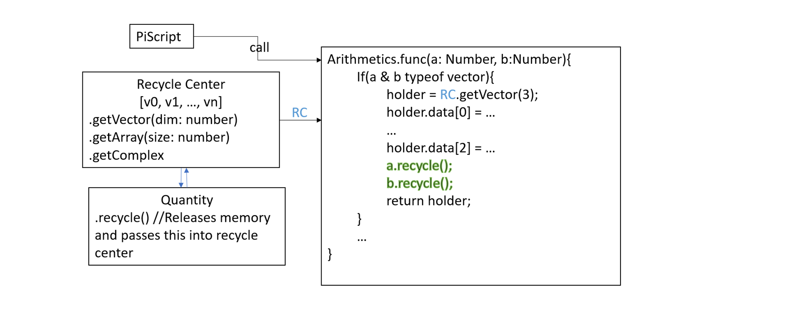
The abstraction of calling getVector should be transparent to users in that it appears as if a new vector has been 
instantiated, and the user will run into no trouble with manipulating this vector to arbitrary degreees without 
worrying about the rest of the program. In the algorithm, after each Arithmetic's function is called, 
the two (or one or three in some cases) quantities passed in as parameters will have their memories released 
at the end of the operation. **Once recycle is called**, the quantity is passed into the recycle bin and its values 
are subjected to overwriting by other usages. This doesn't mean that its original references are nullified, 
but the values that the quantity holds is no longer reliable. As an example, consider piScript
`A.add(A.cross(a, b), a)`, where a, b are both vector typed quantities. After evaluating `A.cross(a,b)`, 
a new quantity `h` is instantiated to hold its value, since the recycle bin is originally empty,
`a` and `b` are both placed into the recycle bin and their data are now unreliable. Now `A.add(...)`
invokes for the value of the cross product `h` and the value of `a`. Now `A.add`
requests for a quantity holder, then the original instance of `a` gets popped from the recycle stack. Then in add:
```typescript
for(i in range(3)){
    a[i] = a[i]+h[i];
}
a.recycle();
h.recycle();
return a;
```
Here the correct result is yielded despite that `add` invokes on the value of `a` whose memory has already been
released. In general though, this practice is not safe, as we might encounter the case where the data of a released
quantity has been modified. Consider for example `A.add(A.add(A.cross(a, b), a), a)`, data of `a` is changed after
the first `A.add`. To solve this problem we add a lock mechanism on quantities. Where if a quantity is accessed multiple
times in piScript, it is locked until the whole piScript has completed it operation. When a quantity is locked, it 
refuses to go into the recycle bin when `.recycle()` is called, so that its data will not be modified. It can also 
be released from the lock state by invoking `.release()`. 

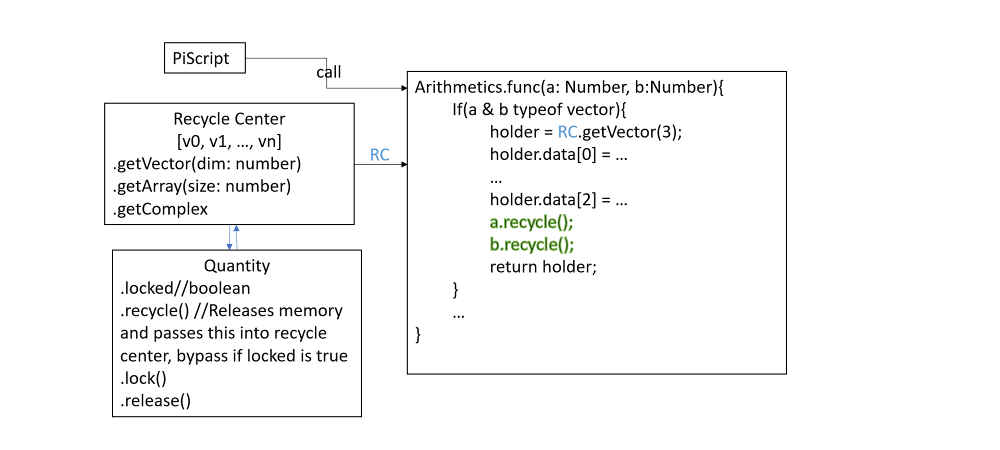
But how would Core know which quantities to lock, and when to release them? 
Let's start by examining an arbitrary expression, written in laTeX `$a=b-c\cdot (d\cross b)$`. Here only `b` runs
into the danger of memory modification. After compiling, `b` as a variable takes on one of the variable types:
algebraic, function, or constant. Its values are retrieved using the `get(i,c)` syntax, where `i` is the reference
index of `b`, and `c` is the context. 
* If `b` is **function typed**, its value is retrieved by calling evaluate behind
the hood, where evaluate invokes some piScript, which then invokes Arithmetic functions at the root level, which always
yields a quantity that enjoys independent memory, hence their memory can be immediately released after usage, and no lock
need to be placed.
* If `b` is **constant typed**, its value is stored directly in the reference list, and reused every time it is invoked,
hence it needs to have a lock place on its quantity. Generalizing this pattern, every quantity stored in the reference
list should be locked, and released after the reference list is updated through dependency pulse
* If `b` is **algebraic typed**, its value is retrieved from context, and also may get reused for multiple times. Hence,
the best practice is to lock the quantities tha are fed into the context. Further, since it is already guaranteed in
situations like populating vertices, the usage of context follows a certain determined pattern, and the type of the 
quantities is not assumed to change. Hence, we can just keep the same set of quantities in corresponding positions in
the context matrix, and feed their data iteratively without ever releasing their memory.

```typescript
class Quantity extends Number {
    locked: boolean;
    type: string; /*enum*/
    data: number | Quantity[] | number[];
    size: number;
    lock:()=>void;
    release:()=>void;
    recycle:()=>void;
}
```
#### More on recycle bin of quantities
Programmatically, this is a tactic to bypass garbage collection and object creation by keeping instantiated memories in 
a queue, and putting them into use whenever needed. However, this doesn't mean any trouble if we stopped using an
instance of Quantity without releasing its memory by calling .release(), kind of "forgot" about it if you may, the 
memory is not actually lost. Because the native garbage collector of javascript will catch those lose strings and
destroy these objects, just causing a slightly higher memory complexity and runtime cost, but as long as the majority
of instances of Quantities are recycled, we should be safe.

As to the specific implementations, there is certainly an issue of reusability. It is almost guaranteed that arrays will
hold multiple elements in its data array, typically larger than 3 in size. Vectors will hold less or equal to 3,
elements, if the underlying problem is mechanics or E&M related. The most efficient way of reusing arrays is when 
its size remains the same. When we pass an array with a larger size to an array with a smaller size, the extra memory
allocated is wasted, increasing space complexity. When we pass an array with smaller size to a larger required size,
allocating additional memory increases time complexity. Now since complex numbers are consistently 2 component 
quantities, its instances can be kept in a separate queue or stack, and popped whenever needed.
```typescript
complexQueue = [Q([1,2]), Q([2,-1]), Q([34,45.23])] //Example of a complex number recycle queue
```
For array and vector quantities, we shall use two queues where elements from arrays and vectors are
queried from interchangeably. One recycle queue contains quantities with size less or equal to 3, and the
other contains quantities with data size larger than 3. 
```typescript
smallQueue = [Q([2,3]), Q([1,2]), Q([2,3,4])]
largeQueue = [Q([2,4, 5,6,7]), Q([-2,34.4,54, 1.2, 9.6])]
```
The remaining question is whether a queue structure or stack structure should be used. A fast implementation
of queue requires the use of LinkedList, which by itself is quite slow in javascript compared to regular Arrays.
A stack naturally utilizes an Array, and is expected to perform faster under the stain of computations. Second, 
as vector operations typically occur while preserving the dimension of the operands, we should expect locality
in the dimension of the invoked data. So this also persuades the use of stacks. Now what to do when the top of
a stack does not have the same dimension as that requested by the `getVector` method? 

We may choose to discard elements until the exact matching dimension is found. But considering that we may want to 
achieve efficiency when the size of quantities appear as alternating, and discarding elements that we can reuse 
every another time causes waste. Thus, it is probably reasonable to grow the size of quantities in stacks at a
factor of 2, once they go over 3.

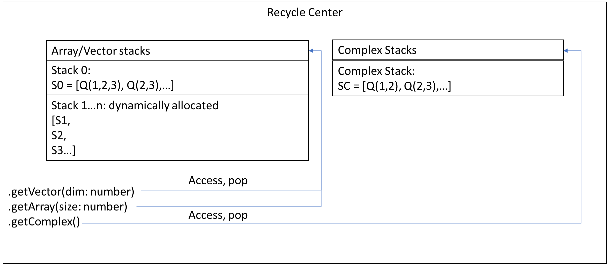
It also makes sense to limit the size of stacks, to avoid keeping too much unused memory. It is probably 
reasonable to keep the size of the stacks to 10. Once their length exceed 10, recycling will no longer
push elements on top. As there are no locality of quantity dimension across different expressions, each
variable should have its own recycle center for its evaluation function. The most consistent way to achieve
this then is by making implementing the recycle center into the Arithmetics class, and instead of making it
statically accessed, we can make it instance accessed, simultaneously avoiding issues of synchronization. 
The time efficiency cost will be negligible: 
[instance access vs static access in js](https://stackoverflow.com/questions/30403241/javascript-static-methods-vs-prototypal-instatiated-methods-on-performance#:~:text=The%20static%20version%20is%20faster,t%20have%20any%20substantial%20difference).


### Parameterized Variables
Sometimes we run into an expression with syntax like `a(x)`, where we cannot be sure if the invocation of `(x)` should
be treated as parameters to `a` or should they be a simple multiplication clause, namely that the computed result
should be `a*x`. This pattern is not restricted to parenthesis enclosing a single variable. Consider statement
`f(x+y-2x)`, where the entire clause `(x+y-2x)` can be considered as a parameter, or a necessary way of manipulating
operation precedence to make additions precede the invisible multiplication.

In these cases to deploy parsing conventions such as making letter `f` a parameterized function and letter `a`
correspond to a standalone multiplication variable, it will not only seem arbitrary but also cause great limitations
and perhaps inconsistencies in the user inputs. Neither should we treat differently the case where `(x)` show up
enclosing a single variable versus that enclosing an entire expression, as it is common for parameterized functions
`f(x)` to take a complex expression in place of its parameter, in order to simplify its written form.

Thus, the only logical way to determine the behavior of such a syntax, e.g `f(x)`, which we call the parameterized
variable clause, is by leveraging core to **first retrieve** (or update) **the definition of `f`**, and upon
seeing whether it is a parameterized function, or a standalone variable, and then treat it accordingly.

The job of the parser becomes much more simplified. It simply needs to recognize the pattern `v(...)`, where
we use `v` to denote variable names, and instead of assuming an invisible multiplication between the `v` and
the `(...)`, it should collapse the `(...)` clause under `v`, and change type of `v` from `$` to `func$`.
Type `func$` is our unique denotation of **_parameterized variables_** (as opposed to variables `$`),
and it is up to the core to treat them as parameterized functions or variable multiplications.

#### Core resolution
The challenge with core generating the `piScript` of such a clause is in that, `piScript` is not supposed to be
rewritten once it is generated, even if its underlying dependency changes. This is crucial for the expandability
and time efficiency of the language (Pendulum system), so no exceptions will be made here. What can be changed
then, is the result that the `get(i, c)` calls in piScript yield. However, if we were to generate a piScript like
```typescript
//the expression is $\sin(x)f(x)$,
let f = get(0, c);
if(f instanceof Function){
    return a.invisDot(a.sin(get(1,c)), f(a, c, [get(1, c)], pm));
}else
    return a.invisDot(a.sin(get(1,c)), a.invisDot(f, get(1,c)));
```
such a pattern is neither efficient in terms of generated code complexity (each `func$` clause costs 2 times
branching complexity), nor in terms of consistency (bad readability and reliability of heavily branched statements).

Thus, we want to adopt only one branch in the piScript and hope that it has the flexibility to change behavior
according to the case of `f(...)` being a _variable multiplication_ or a _parameterized function_ invocation.
Obviously here the most general statement is:
```typescript
 let f = get(0, c);
 return a.invisDot(a.sin(get(1,c)), f(a, c, [get(1, c)], pm));
```
where the yielded result of `get` is consistently a function, only that when `f` is a constant or an
algebraic variable, `get(0, c)(get, c, [get(1,c)], pm)` executes `this.value * p[0]` and returns the result of
multiplication, instead of actually evaluating the piScript of `f`, taking p as a parameter. The code segment
`this.value * p[0]` is a predefined routine hardcoded into the reference list upon reference list configuration,
where `this.value` is pseudocode for retrieving the value of `this` variable, whether through running the piScript,
looking up in the constant reference list, or looking up the context.
Previous implementation of reference list configuration:
```typescript
 function configureRl(varName: string){
        let reference = this.referenceList[this.rlMapping[varName]];
        let depVar = this.dependencies[varName];
        let accessStyle = this.functionAccess[varName];
        //Information access style, style 1 and style 2 are equivalent for local Algebraics,
        //except style 2 is slower but permits parameter as multiplicative clause
        reference[0] = (accessStyle!=undefined)?2:depVar.type;
        switch (reference[0]) {
            case 1://...
            case 2:
                if(depVar.parameterized)
                    reference[1] = depVar.evaluate;
                else
                    reference[1] = (a:Arithmetics,c:Number[][],p: Number[])=>{//Special dealing with func$ type
                        return a.invisDot(depVar.evaluate(a,c,[]), (p.length!=0)?p[0]:1);
                    }  
                break;
            case 3://...
        }
}
```
you can see the code `reference[1] = (a:Arithmetics,c:Number[][],p: Number[])=>{//Special dealing with func$ type
return a.invisDot(depVar.evaluate(a,c,[]), (p.length!=0)?p[0]:1);
}` serves to assign a predefined function for evaluating multiplication. This is called the pseudo-evaluation
(or pseudo-multiplication) clause.

#### Multiple access parameterized variable
The logic behind this implementation is sound, with one exception to be made. Here ` let accessStyle = this.functionAccess[varName];`
is accessing the access style information, namely whether the dependent variable is a parameterized variable,
that was determined during the stage of statement tree analysis. This allows for only one access style
assigned to each unique variable. If a dependent variable ever shows up in the expression as `a()`, it is marked as
parameterized access in the hosting variable, and all of its other occurrences will yield an evaluation function
as the result of `get`, even when piScript is in fact expecting a `Quantity`. Consider expression `a+a(12y+x)`,
where the first `a` is supposed to be accessed variable style, but due to the denotation of `a` as parameterized
style, piScript `a.add(get(0,c), get(0,c)(get, c, [a.add(...)], pm)` will no longer operate correctly (since
`get(0, c)` yields a function).

Considering the situation, it means that `get` needs to inform whether the dependent variable access is expecting
a quantity, or a parameter accessed evaluation function. For consistency reasons, we incorporate
it as an optional parameter, changing the signature of get to:
```typescript
get:(i:number, c: Number[][], s = 0)=>Number
```
where the third parameter s decides that get should return an evaluation function when
it is set to 1. In the reference list, we adjust the configurations of each reference to
simultaneously hold the variable accessed quantity and the parameter accessed
function.
1. Constant
```
let reference  = [type: number, value: Quantity, eval: Function]
```
2. Function
```
let reference  = [type: number, eval: Function]
```
3. Algebraic
```
let reference  = [type: number, varIndex: number, 
      subIndex: number, eval: Function]
```
#### Parameter passing & vector processing
1. For a parameterized function access `f(x)`, we notice that the value passed into the piScript of 
`f` is a Quantity inside the parameter list `p:Number[]`. Then in piScript, the value of this
parameter overrides the corresponding context value of `x`. Now to ensure that in case of `x`
being a Quantity and showing up in multiple parts of an expression (e.g. `f(x) = x^2 +x`), its value
is not overwritten by the recycling mechanism, we simply need to **lock its value when entering
it into context**.

2. For an expression like `f(a,b,c)`, it is also recognized as a `func$` clause. But in addition to 
the possibility of it being a multivariable function access clause, it can also be representing the
variable `f` invisibly dotted into the vector constructor `(a,b,c)`. In this case we make a tweak
to the **pseudo-multiplication** clause and load the parameters sequentially into a quantity holder
of vector type, and perform invisDot between the preceding `f` and the quantity. 
We don't lock the quantity in this case.

3. Let's consider the possibility of multiple parameterized function calls, with a stacked structure:
```
f(x) = \sin(x)+x
z = f(x^2)+x
```
Now starting with the top level hierarchy, `x` is populated by the evaluation handle to be of a certain
value say `2`. Then `x^2` is passed down to f as a parameter. `f` then overrides the namespace `x` inside context
by the value `x^2 = 4`. Then upon the return of the evaluation of `f`, context now holds `x` with value `4`
instead of the original value `2`, and it is used to perform the addition, yielding, `z = f(2^2) + 4`, which
is obviously incorrect. This leads us to consider a stack structure for context in the next section.
### Context revisited
We want nested parameterized function calls to override the context variables corresponding to the parameters
specified, but we also want the value of those context namespaces to be restored before the parameterized
function returns. Now instead of setting aside storage to store the original value of the context namespaces,
we can simply make each namespace to host a stack, and any overriding values by parameters are pushed onto and
accessed from the stack top. Before the function returns, pop the overriding values by parameters from
the context namespaces, and we will be left with an "unchanged" context.

As an example with `c, p, pm` as context, parameter, parameter mapping respectively: 
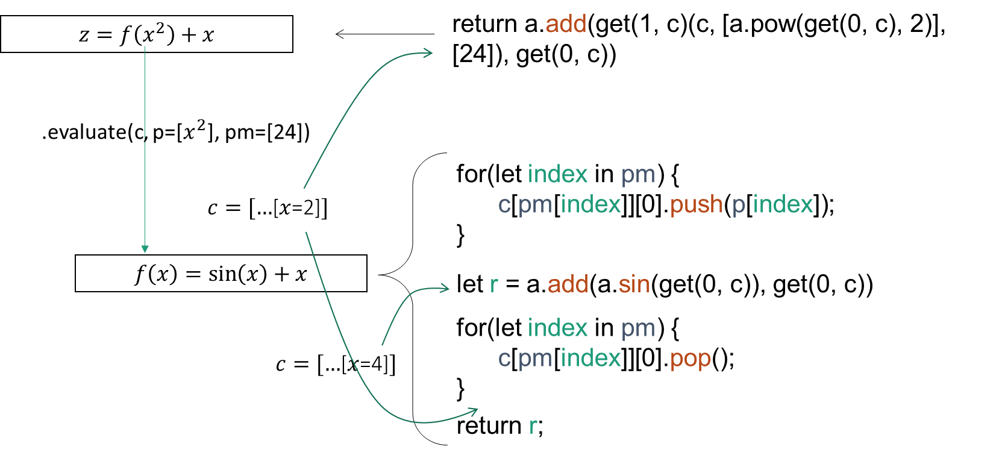
Combining with the fact that we also need to lock quantities before passing them into the
context, and releasing them and recycling them after the parameterized call routine is complete, we shall
turn context from a 2D matrix into a class and use field methods to streamline these operations.
```typescript
class Context{
    /**
     * 2D array of namespace enclosing stacks
     * of Number
     */
    context: Number[][][];
    /**
     * Locks value if instance of quantity, pushes value
     * into the corresponding stack
     */
    push:(index: number, subindex: number, value: Number)=>Number;
    /**
     * Returns the top of the corresponding namespace
     * without modifying it
     */
    access:(index: number, subindex: number)=>Number;
    /**
     * Pops value from the corresponding namespace, releases
     * it and makes an attempt to release it
     */
    pop:(index: number, subindex: number)=>void;
}
```
#### Quantity lock revisited
From the above mechanism of parameter overriding, you might have noticed something subtle,
if the parameters passed in were quantities that are originally locked, the parameterized function
will unlock it after execution regardless and recycle it. This deviates from the **transparency** of 
parameterized function calls to the quantities. Namely, if a quantity was initially **locked**, it does
**not know and should not care whether it gets passed into a parameterized function as a parameter**,
until the source of its lock decides to release it. All functions of the Arithmetics behave this way,
namely that they respect the lock that was placed on a variable, and does not alter its state or
recycle it.

This should also be the case with parameterized function calls. That is even though in parameterized function
calls values popped from contexts in the end are unlocked, those that are locked at the time when they were
passed in should remain locked and preserved from recycling at the time the function call exists. To achieve
this, **one needs to count the times locks are placed**, and **decrement** that count everytime release are called.
This way **locks placed for different purposes** are **differentiated**, and only **when all the creators of these
locks** think that the variable is released, namely when the lock count is decreased to 0, can the variable be
recycled.

```typescript
class Quantity extends Number {
    lockCount: number;
    type: string; /*enum*/
    data: number | Quantity[] | number[];
    size: number;
    lock:()=>void;
    release:()=>void;
    recycle:()=>void;
}
```

### Statement resolution
Statement resolution is the process that Core goes through to identify which variable a TeX statement is meaning to define. 
There are two types of statements resulting in different statement trees:
1. `a: 12 + b`. Here the variable label is specified by the user, and there are no equal signs.
2. `(b): b = 12.5^2 - x^2`. Here an equal sign is present in the statement. If the variable label is not specified by users, the machine
    should find a way to deduce that the statement is defining b.
   
The first case is trivial, generating a single expression in the root of the statement tree corresponding to the label that the user specified. 
The only check that needs to be made is that the label itself doesn't show up in the expression, as we would want the user to explicitly specify that
they want to define a variable implicitly, so `a:12+b+a` will be invalid, but `a:a=12+b+a` is permitted.
The second is trickier. Its statement tree will look something like this: `[expression1, expression2]`. This gives Core the responsibility to figure 
out on itself what the expression is trying to define, and assign the label automatically.
The interpretation currently follows these procedures:
* Check whether the left expression consists of a single variable. 
        If yes: Check if it shows up in the right expression.
            If yes: pass.
            If not: check if it shows up in the right-side expression.
                If yes: pass.
                If not: check if the single variable is x, y, or z.
                    If yes: reserve this as a graphics statement. Label it with something like ($Graph)1.
                    If not: the expression on the right makes a definition for the variable.
    
* Do the same thing in the opposite direction.

* Now the definition we are seeing must be implicit. Check if either side of the equation contains undefined variables that doesn't show up 
    on the other and that there is only one such variable.
    * If yes, check if that variable shows up at only one spot in the side where it exists.
        * If yes: this is a separable variable, and the whole equation is a implicit definition of this variable. Isolate it on the left side of the expression.
        * If not: This is a non-separable implicit function.
    * If not, pass.
    
* Now the function is fully implicit and unspecific. User must specify the variable label unless both x and y show up in the expression. In this case the statement
    defaults to a graphing only variable, and the right side of the expression will be subtracted to the left side for implicit vertex mappings.
#### Label guessing
Most protocols around label guessing have been discussed above. This is a procedure carried out by the core prior to the direct definition resolution. 
If user puts nothing in the label field, which leaves the equation to look something like this: ``_: x^2+y^2``, Pendulum will make an attempt to guess
the label by invoking the label guessing module in core.
#### Graphable statement
It was originally intended for Pendulum to determine the graphability of a statement at the time of its initial resolution, by reading the number of undefined
algebraics it has, and react accordingly. But this will unnecessarily complicate matters as it will require the graphability of each statement to be redetermined
whenever something on its dependency have changed, thus changing its label and consequently its entire variable interpretation. Instead then, graphability will
be something inferred within the constructed variables, independent of how it is constructed. When the variables are instantiated, and each time a dependency pulse
is issued, an attempt to redetermine its graphability will be made. 
Graphable statement examples:
``y=x^2+c^2`` explicit y-cartesian; ``z^2=x^2-y^2``, implicit cartesian; ``f(x)=x-a``, where ``a = 3``, explicit (z)-cartesian; ``f(x)=x-a``, where ``a = 3-x``,
explicit (z)-cartesian; ``\vec{v} = 12\vec{r}-2(x,y,z)``, explicit vector field.

Non-graphable statement examples:
* ``z=x-a+y``, where ``a`` undefined, problem: 3 dimensional manifold in 4 space, not yet supported.
* ``z+a-x=x-5+c``, problem: 3 dimensional manifold implicitly defined in 4 space, not yet supported.

Up to this point we can discern a general rule for determining the graphability of equations. Based on the dimensionality of the visualization context, a
n-dimensional graphics context may permit up to n independent variables, or so-called "algebraic variables" in a single equation. If there is no equation
present, but just an expression, then the number of algebraics permitted in that particular expression may be at most n-1.
#### Anonymous statement 
Anonymous statements, also known as graphable statements, define anonymous variables that are labeled by numbers, such that the evaluation results of these variables
won't be taken into account by other variables. Anonymous appear on the user interface in the form of ``1: y=sin(x)``, and users are not able to specify a variable
to be anonymous by labeling it. Instead, by leaving the label field blank, the default label generated by the core may be anonymous based on the following
two conditions:
1. If a statement contains too many algebraics for the core to guess a default label.
2. If a statement contains x, y, or z as stand alone algebraics, which would otherwise be inferred as the default label.
### Implicit evaluation
Sometimes it occurs that the evaluation of fully specified variables are not immediate. This can either be due to them defined by an implicit expression, or the expression
that define them are embedded within a larger system of equations. This requires additional techniques, especially gradient descent, to be employed for their solving.

* Sometimes definition of a variable/function needs more than one statement. This can either occur for an ODE statement, a PDE statement, or a system of equation.
* When a system of equation shows up, they manifest in the statement resolution stage as circular dependencies. If several variables show mutual dependence in the dependency walk,
  the evaluation of these variables will end up requiring that their values be "given". See diagram:  
  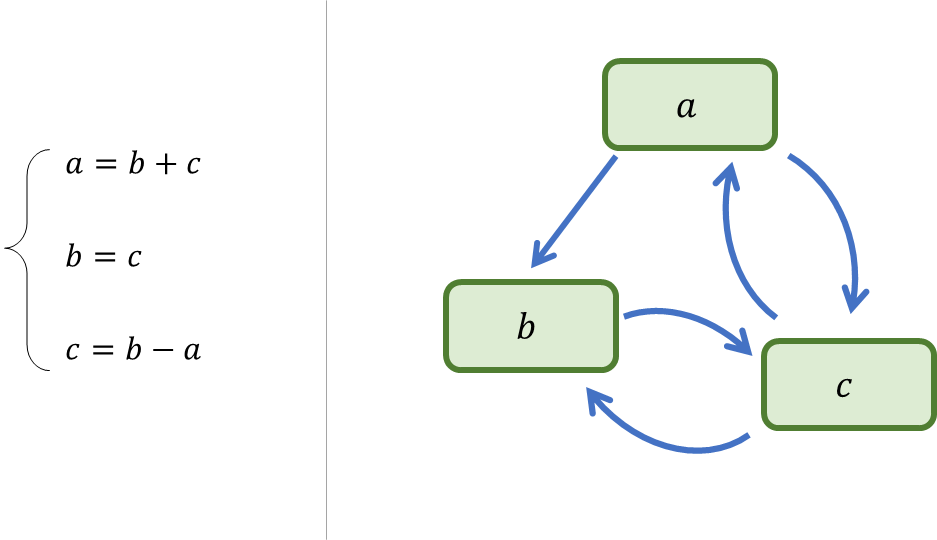  
  Here cycles are formed between _a_ and _c_, and _b_ and _c_. Now, regular evaluation techniques are no longer effective. The determination of the value of _a_ implies that of both
  _b_ and _c_. Upon this, the variables _a_, _b_, and _c_ will be placed into a single evaluation group inside the Environment. The technique to be deployed is gradient descent.
  The first thing to do when resolving the statement tree is to subtract the right expression by the left one. Then for the entire evaluation group, we have:  
    
  The same technique can be applied when the statements are all implicit, including stand-alone definitions.

### Differential equation solver
  
In case of differential equations, the identifier that the Core looks for is dy/dx, which gets translated into \diff{y,x} inside the statement tree. This grammar identifies
a differential term, which in this example consists of y varying in terms of x. The accepted notations are dy/dx when the variable y is non-parameterized, or \dot{y}, y' if
y is a parameterized function. When y is defined else where, then dy/dx denotes the differentiation of y, and is treated as a function, parameterized or non-parameterized. 
If y is never defined else where, or the variable in concern is explicitly labeled to be a definition, then \diff{y,x}, cues the Core to numerically solve the differential equation.

* When solving the diff eqns, the core relies on a cache structure built into variables. Default values for the initial values of the equation to the n-1th degree will be supplied, which
  the users can access or make adjustments to. The module then goes on to span the "entire" solution space using methods such as RK2 or RK4 along the positive and the negative directions.
  During this process, the stepped values at various points of the differential equation are stored into a sorted Cache, which is expected to have a log(n) access and storage time.
  
* The time complexity of such a computation is O(_mn_) for a *n*th order differential equation that has a total time step of _m_.

* Pendulum has implemented three types of solvers, using Euler’s method, RK2, and RK4 (Runge Kutta method) respectively. Euler’s method uses a single step during each time increment and
  its error increases by O(δ^2). RK2 uses 2 recursive steps in each time increment, performing a second order Taylor Approximation from each starting point, while RK4 uses 4 recursive 
  steps per time increment, and performs a 4th order Taylor Approximation. The error of the methods are O(δ^3) and O(δ^5) respectively.  
  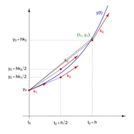  
  
* High order differentiated terms shall be written as for example \diff{y, [x,2]}, which states that y is differentiated in terms of x twice. When resolving the statement trees, differentiated
  terms of the highest order of **undefined variables** are prioritized as candidates for evaluation targets. In normal cases of ODE, it is recommended that the differentiated term of the hightest
  order gets placed at one side of the expression, and all the rest gets subtracted or moved to the other side. This is because during actual computation processes, only the highest term gets 
  evaluated based on the rest of the expression, while all the lower-order differentiation terms iterate their value out of the initial conditions.

* In an ODE or PDE, if the highest order differential term is mixed up with the rest of the equations, it is still identified as the evaluation target. Core will use iterated gradient descent to try
  to find the value of the differential term by solving unknowns. This will slow down the computation of the ODE/PDE, which is why unless the differential equation is 
  necessarily implicit, it is recommended that the highest order differential term gets specified explicitly.
  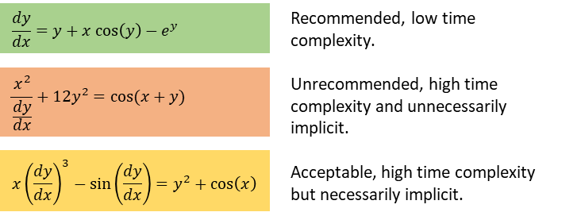

## UI
Short for user interface, the section on the left of the software window for user inputs and providing feedbacks. The updates made by users on the user interface will be sent to the Core
through asynchronous hooks.
### Loading
Many dynamic functionalities of the UI need to be realized by javascript. The UI module serves as the centralized location
for the management of the entire user interface. After the initialization call back from jQuery, Pendulum will 
invoke the load() function of the UI. Note that UI is a "static" access module, reflecting that there is only one window,
namely the browser page that is under management. The load function call then invokes a sequence of loading of HTML components
of the UI, including:
* loadDragBar();
* loadTags();
* loadShelves();
* linkNameDefControls();
* loadDefSettingsBtn();
* ...

After this sequence is invoked, the UI will be completely up and running.
### Definition

The pair of statement field and its corresponding label field that allows users to define variables.  
#### Label Field
The label field to the left of the statement field accepts a single LaTeX letter (with subscripts). The letter is the label for the statement,
denoting the very variable that the user is trying to define using the entire math statement, which the Core will then try to extract. If the label
is not specified by the user, the Core will read the statement and try to read the user's intent. A suggestive label will be posted on the same field
with a light gray color.
#### Statement Field
The LaTeX field on the right is dedicated to user inputs of long mathematical expressions. Expressions entered here will be parsed into
statement trees to reflect the hierarchical structure inside computation, and then interpreted by Core into pi-scripts.
#### Definition ID's
The TypeScript objects representing the visual components such as label field and statement field are instances of the 
classes DefControl and NameControl respectively. To ensure consistency, their id's will be generated sequentially
by an incremental id generator, and once assigned, will not vary during the course of the existence of a particular field.
The entrance of variable labels inside these fields run independently of the field id's, however corresponding defControl
and nameControl do share the same id.
#### NameControl interface
The NameControl class gives a uniform interface for controlling the label field. Not only does it provide a parameterless
method called `getLabel()` that yields a parsed label (as a SymNode) of its LaTeX content, it also accepts hints through
the `setHint()` method that takes a SymNode and generates its corresponding LaTeX, and displays it in a dimmed MathQuill
static field as the machine interpreted label directly under the normal label field.
### Parser
A very important sub-module of UI that will serve the function of converting user inputs into statement trees. The reading of individual TeX commands relies
on a finite state machine combined with a macro dictionary. The conversion of the linear command list into the statement tree is then to be performed recursively.
This is the first and essential step for Pendulum to break down and fully comprehend the mathematical expressions typed in by users. For a more detailed break down
of the mechanisms behind parser, see the section on parsing.

### Progress bar

### Slider

### Multi-var slider
High dimensional slider for grouped operations on variables. Potentially going to be implemented inside canvas in some future time.

### Hint
The text underneath fields that reveal the variable's state in core.
### Pi-script fields
Fields for editing of pi-scripts.

### Group structure

## Parsing
Parsing of information rich mathematical expressions written in LaTeX into structured, machine-readable statement trees involves so much technicalities and details 
that the principles of parsing deserves a section on its own. In this section, we will introduce the steps through which the original TeX gets broken down and
converted, as well as the algorithms that run in them. We will also explain the various class structures utilized during the construction of statements.

### Linear Parsing
Linear parsing is the first step in making sense of the user-typed TeX. The raw TeX expressions looks something like this: `\frac{dy}{dx}-x^2e^{ix}=y-x`.
The linear parsing is expected to take a raw string of TeX, read it in character by character, and come up with a linear regrouping where each element in the list
corresponds to either a parsed symbol, a parsed operator, or a number, that honestly reflect the original expression in the order in which it came in. In accordance
to the example above, we would expect something like: `[frac, d{x}, d{y}, -, $x, ^, 2, invisTimes, e, ^, {, i, invisTimes, $x, }, =, $y, -, $x]` as the output.
This is called a **Token List** that the program keeps track of, which will contain the final output of linear parsing upon its completion.
Sometimes the parsed results that gets output may look a bit more complicated than the original expression, despite roughly maintaining the original orders.
In fact, to achieve this, a certain level of knowledge of what each operator represents is required, this is where the power of finite state machines come in.

#### Finite state machine
The scheme of a finite state machine, although often used as a paradigm representation of universal computations, actually turns out to be extremely useful when 
we try to comprehend code strings by reading them character by character. The key concept is that the program will keep track of, besides the current character 
being read, an additional variable called the **state**. This state helps the program "remember" what it has just read in,
and enables it to develop comprehensions of complex syntax. Each time a new character gets inputted, the program responds to the combination of the state and the 
character by taking actions such as adding an operator to the list or modifying the internal state.  
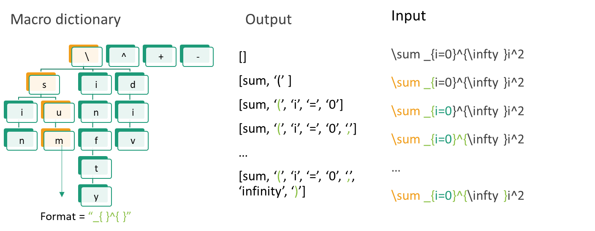
In practice, the state that the program manipulates is held in a macro dictionary. The macro dictionary has a tree structure consisting of maps, 
where the top level map contains entry points to various TeX symbols, especially `'\'`, which serves as the entry
point to a lot of TeX commands such as '\cos' or '\frac'. Initially, the state holds the entire macro dictionary. On recognition of a match with one of the top
entries of the macro dictionary, the state immediately changes to hold the subtree led by that symbol. By traversing down the tree, the program will eventually 
reach a leaf that contains the corresponding keyword for the command and returns it. Note that multiple commands can map to the same operator. For example, if 
`'\div'` was one of the commands encountered, it will end up returning the operator keyword `'divide'`. If the program encounters `'\frac'`, it will also return 
the operator keyword `divide`. 
#### The Token class
The parsed keywords will be enclosed in Token objects. The class contains fields:
```typescript
class Token{
    type: string;
    name: string;
    subClauses: string[][];
}
```
The type can either be a variable `$`, operator `operator`, constant `#`, or structure `structure`.
Sub-clauses will contain lists of symbols that are parsed subclauses of a large operator. 
One can imagine encountering something like `\sum_{n=1}^{20^5}`, for which `[[$n, =, 1],[20, ^, 5]]` will become the value of its field.

In this documentation, we refer to the Token objects based on their types, for
- number, we just write the number itself, e.g. `20`,
- variable, we write the name of the variable with a `$` in front, e.g. `$y`,
- operator, we simply write the name the operator corresponds to, e.g. `sin`,
- large operator, these are operators that contains sub-clauses, we refer to them along with their sub-clause contents:
  `sum[[$n, =, 1],[20, ^, 5]]`.
  
The **TeX lists** are lists of TeX objects.

#### Parse stack for large operators
With the case of certain large operators, such as `'\int'` and `'\sum'`, their parsing do not simply terminate after their keywords. The `'\int'` operator
asks for the lower bound and the upper bound of the integration in the form of `'_{expression1}^{expression2}'`, both of which can be full expressions in TeX 
requiring additional parsing. In these circumstances the parser will enter into the clauses of an operator, and additional TeX objects
are to be read into the parent operator, instead of the root level list.  

To achieve this, an additional variable, the **parse stack** is kept in the parser. Once a large operator requiring a particular format is encountered, such as `\sum` expecting `_{...}^{...}`, the formats are pushed into the stack as
`[_,{,},^,{,}]`, with the left open brackets `{` associated with the corresponding subclauses as the output location, and the right bracket `}` with the 
previous output location that the program shall revert to once exiting the sub-clause. The format characters are popped from the stack when encountered in the TeX string,
when the stack becomes empty, the parse location defaults to the root list. To avoid mismatches, all encountering of the left bracket symbol inside TeX will push a right 
bracket into the stack.

The additional use of parse stack is for checking syntax errors. Whenever tokens of the type _'openstruct'_ is encountered, that means some left-parenthesis-like operator in the expression have been met, 
and its corresponding representation is pushed into the parse stack. If the parser encounters tokens of the type _'closestruct'_, it likewise checks for the matching representation from the 
parse stack, and pops it if found --- if it does not manage to find any matching representation inside the parse stack, that corresponds to an unclosed parenthesis and a parse error is thrown at the location of the 
opening bracket, indicating an unmatched parenthesis. Likewise, if at the end of the TeX string, there are still items in the parse stack, the same parsing error will also be thrown. The last item left in 
the parse stack is a termination token, used specially when the linParse function is called recursively to terminate a tex string parsing before it has been exhausted. For the root level recursion, a $ symbol
is appended at its end that signals the termination of the entire TeX string.

#### The invisible multiplication
A special rule needs to be take note of, that is whenever two variables, or a variable and a named operator are placed back-to-back, an invisible
multiplication operator `invisDot` is inserted into the TeX list. The only difference between`invisDot` and `dot` is that it assumes a slightly higher 
associativity in certain situations.

### Node parsing
Node parsing is the process through which the output of the previous step, a TeX object list, gets interpreted and collapsed into a statement tree.
The container of the output here is a **SymNode**:
```javascript
class SymNode{
    children: SymNode[];
    symbol: string|number;
    type: ['$', '#', 'operator'];
}
```
which is capable of recursively nesting expressions. We abbreviate the SymNodes with their symbol in front and their children contained in brackets.
The statement tree holds the root SymNode. The statement tree is expected to 
contain the expression in the order that it is to be computed, that is, expressions with the highest associativity get computed first, and 
those with the lowest associativity gets computed last. So, it would not be surprising to see expressions with plus signs end up with `plus` as the
root node of its statement tree.

For example, a convoluted expression like `\sin y \int_{10}^{12} e^x dx = 15^{2\cos x}` will get parsed into
`[sin, $y, int[[10],[12]], (, e, ^, x, invisDot, d[[$x]], ), =, 15, ^, {, 2, invisDot, cos, $x}]`. After the recursive parsing, the expected output 
would be:
```
={
     *{
         sin{$y},
         int{
             10, 
             12, 
             ^{e, $x}, 
             d{$x}
         }
     }, 
     ^{
         15, 
         *{
            2, 
            cos{$x}
         }
     }
}
```

The way to achieve this kind of parsing is by resolving the associativity of each of the symbols, and reordering the variables, constants
and operators.
#### Shunting yard algorithm
An enhanced version of the shunting yard algorithm will be utilized for the task of recursive parsing. The key idea behind it is that
all operators would yield a number, so would all the numbers and variables. But depending on the associativity, an operator may act on 
variables to its vicinity, or wait until other operators within its vicinity to compute first, and, depending on whether that operator is to its 
left or to its right, if the operator is to its left, it shall be popped from the stack into the list, allowing it to be computed, or if
that operator is to its right, this operator shall be placed into the stack, awaiting the operator to its left to be executed first, which by itself
may need to wait for the operator further to its right to act on its vicinities. 
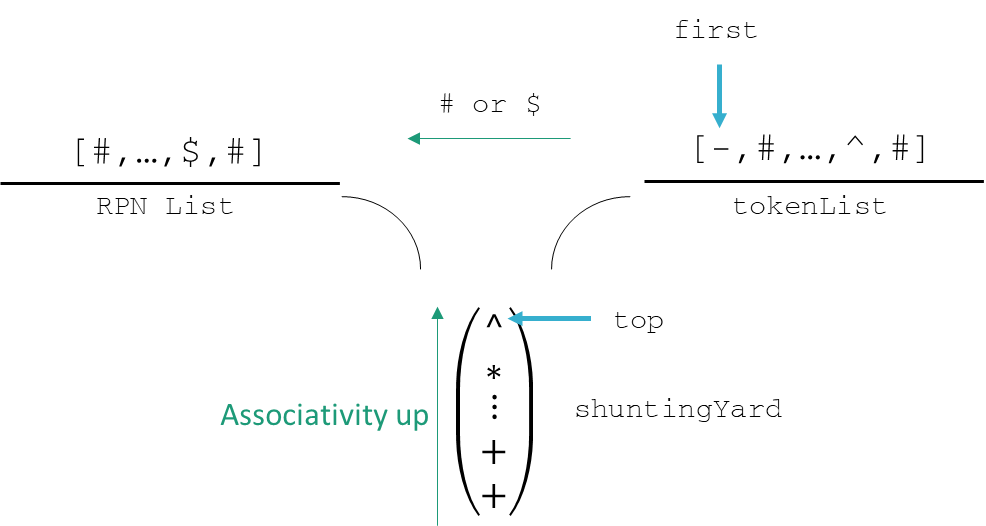
Because the shunting yard is based on a stack structure, it follows the order of last in, first out. Because in an expression operators with higher associativity takes precedence
in terms of evaluation, upon comparison between the first element of the remaining token list and the top of the shunting yard, if the top has higher associativity than the first
it will be popped and added to the RPN, or else first will be pushed into the shunting yard, making it the new top, effectively maintaining the order of the shunting yard
such that operators with higher associativity are always closer to the top of the stack. By this order, the program can effectively make the 
operation that comes later with higher associativity in the expression to be the one that gets executed first. Under this reordering mechanism, and on the premise that each operator will
act on numbers to its direct vicinity, or on operators with the next up associativity to its vicinity (that eventually yields numbers after their operation is done),
the shunting yard algorithm generates an RPN that has effectively the same evaluation order as that of the mathematical expression dictates. 

Once an operator is popped from the stack, it is to be met with the previous terms at its immediate vicinity in the RPN list. The operator is then 
to collapse with the number of operands that it expects and instantiates a new SymNode object in its place. That is to say, after the tokens are pushed into the RPN list,
they are not kept in their position as in a conventional RPN, but are collapsed in an order that the expression can correctly be executed. After this chained collapsing,
a properly defined mathematical expression should always yield a single SymNode as the root to all other SymNodes in the RPN list. The resultant statement tree is more 
posed for the reflection of the structure and evaluation order of the expression than for direct evaluation. One can say that the statement tree captures the algebraic
"structure" of the expression, which makes it utilizable for the Core.

##### Comparing Associativity

The key advantage of the shunting yard algorithm is that it is able to sort out the executing expression of an expression in linear time, despite the
expression itself taking on complex structures of nested parenthesis and operators with varying associativity. Due to the diverse set of token types, 
from functions, operators, to numbers and so on, the associativity is no longer a singular value for each of the parenthesis. In the classical shunting
yard, if an operator, for example +, is compared to the operator `*`, whether the + comes before `*`, as that in `a+b*c`, or if it comes after, as that 
in `a*b+c`, it is always determined to be so that associativity of + is less than *, ensuring that * is always popped into the RPN before +.

In the program, if we have:
``` typescript
let remainingTokenList = [+, number3, ...];
let shuntingYard = [*, ...];
let RPN = [number1, number2];
```
Then by assigning associativity 1 to + and associativity 2 and *, we have:
``` typescript
if(+.associativity<*.associativity){
    while(first.associativity<shuntingYard.tpo.associativity)
        RPN.last = shuntingYard.pop();
    shuntingYard.push(+);
}else{
    shuntingYard.push(*);
}
```
and this is expected to yield correct behavior for expressions that involve operators that takes two operands at both of its sides, and operands made
out of only numbers.

However, as a counter example to this, if in our expression we encounter a token list:
`[..., 2, *, sin, 5, *, x]`, suppose we have read things in such that 

``` typescript
let remainingTokenList = [sin, 5, *, x];
let shuntingYard = [*, ...];
let RPN = [..., 2];
```
Now observe that we would want to evaluate sin, namely sin(5*x) first before multiplying that with 2. By the prevoius
logic, that means sin has a higher associativity than *, and hence sin will be pushed into the shunting yard, making:

``` typescript
let remainingTokenList = [ 5, *, x];
let shuntingYard = [sin, *, ...];
let RPN = [..., 2];
```
. Moving on, we read in the number 5, and pass it directly to the RPN, so that we have:
``` typescript
let remainingTokenList = [ *, x];
let shuntingYard = [sin, *, ...];
let RPN = [..., 2, 5];
```
And here is the problem, if we still went on with the assumption that sin has a higher associativity than *, then 
we would pop sin into the RPN and add * into the shunting yard, making:
``` typescript
let remainingTokenList = [x];
let shuntingYard = [*, *, ...];
let RPN = [..., 2, 5, sin];
```
as a result, the RPN will end up as `[..., 2, 5, sin, x, *, *, ...]`, effectively creating the execution order
`(...(2*(sin(5)*x)))`, but this is not what we wanted to specify. We actually wanted the `*` that comes after `sin`
to compute before `sin`, and we want the `*` that comes before `sin` to compute after everything inside the `sin` has been
computed. In fact, in general, there may not even be a partial ordering for all the operators and functions. What we have to 
do then, is to examine the associativity of the operators/functions on a case by case basis, and taking extra care to
differentiate the left/right order that two operators under comparison comes in with. In the above example, if `*` is to the _left_ of
`sin`, that is, if `*` is top and `sin` is first, `sin` has precedence over `*`. Otherwise, if `*` is to the _right_ of `sin`,
`*` has precedence over `sin`, and hence a higher associativity. That is to say, that operators do not only display left or right associativity when
they are compared to itself, in case of `^` and `^` for example, but also when they are compared to other 
operators/functions. This asks that we encase all the complexity of comparing different operators in a singular function 
`compareAssociativity(operator1, operator2):boolean //return "has higher associativity than"`, and changing the central clause of shunting yard
into:
``` typescript
if(+.associativity<*.associativity){
    while(!compareAssociativity(operator1, operator2))
        RPN.last = shuntingYard.pop();
    shuntingYard.push(+);
}else{
    shuntingYard.push(*);
}
```
To organize the comparison inside `compareAssociativity` in a reasonable manner, we can avoid writing n*n conditional clauses, where
n is the number of different types of operators and functions. We may instead create two lists of associativity rankings, called the 
**left association rank**, and the **right association rank**, so that upon comparison, a corresponding rank for `operator1` is retrieved,
and a rank for `operator2` is also retrieved, and the function correspondingly returns the comparison between these two ranks; that is to
say, until exceptions are encountered, and can be easily dealt with conditional checks, this implementation should be generally applicable
to the purpose of correctly ordering expressions.

_The other difference is that compared to conventional shunting yard parsing, the operators that we deal with might take on more than two operands,
or they might be of the type "function" that permits only one operand as its parameters. But as long as the operators are dealing with values
that are to its direct vicinity, and that the associativity between operators are correctly configured, there will be no problems or additional troubles 
that we need to go through in parsing them._

#### Additional SymNode Standards
```javascript
class SymNode{
    children: SymNode[];
    symbol: string|number;
    type: ['$', '#', 'operator', 'func$'];
}
```
Certain cases of more complicated types of definitions are worth going over. 

In particular, statement ```f\left(...\right)``` gets parsed 
into a 'func$' token with subclauses, under the condition that it is a stand-alone variable immediately followed by parenthesis. Depending on
the number of parameters, SymNode f should have the corresponding number of children taking the respective root of the parameters.

The large operand summation 'sum' in statement ```\sum_{x=1}^{12}\cos\left(x\right)+...``` gets parsed into two subclauses,
one corresponding to the lower bound specification, one for the upper bound, each holding a linear token list. The lower clause and
the upper clause should be syParsed respectively and collapsed into separate trees. The roots of the upper clause tree
and the lower clause tree shall go into the children of the SymNode representing 'sum', along with the root of the statement
that it is operating on. 'sum', aside from its clumsy definition body, should be treated somewhat like 'function' typed token
'sin', where the right associativity holds up until addition/subtractions.

#### Parenthesis special cases: function collapse & vector collapse
In normal shunting-yard parsings, parenthesis are discarded. However, in some cases parenthesis may entail important conventions
or information besides evaluation priorities. 
* In particular, equations of the form `cos\left(...\right)`, namely a function followed by a pair of parenthesis implies that the content
enclosed by the parenthesis should be immediately absorbed by cos no matter what comes after. As opposed to the bare case where
`cos x^2` may seem indistinguishable from `cos(x)^2` when we discard parenthesis, `cos x^2` gets parsed into `cos {^{x,2}}` while
the latter becomes `^{cos {x},2}` due to the function collapse protocol. _This is the main way how functions differs from operators
in terms of operator typing_.
  * The algorithm is when a closing parenthesis gets collapsed with the opening parenthesis in the parse stack: `[..., (] <- ')'`-->
    `[(,?, ...] <- ')'`, it checks one element further down into the parse stack (shunting yard) to see if the new top is function typed
    right after the collapse, `(...)<-[function, ..]` so that function typed token will be popped and absorb the parenthesis enclosing
    node: `function{...}`.
* Equations of the form `(...,...)` with at least one `,` token are considered vector typed. A vector typed SymNode will enclose
the components as its children, and more on vector typed variables later.

#### Variable name conventions
`x_0` gets parsed into "x0". `x` gets parsed into "x". `\vec{x}` or `\mathbb{x}`
gets parsed into ">x". All of them are typed as `$` in the token class. Note that
`\vec{x}` and `x` refer to two distinct variables under this implementation.
